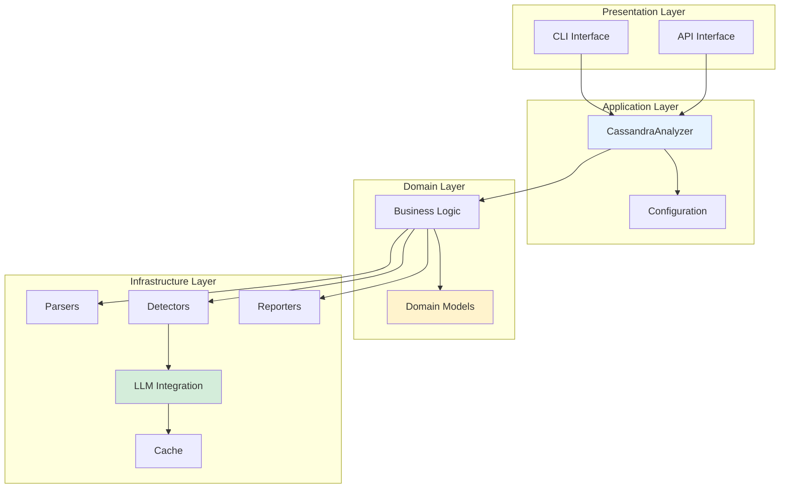
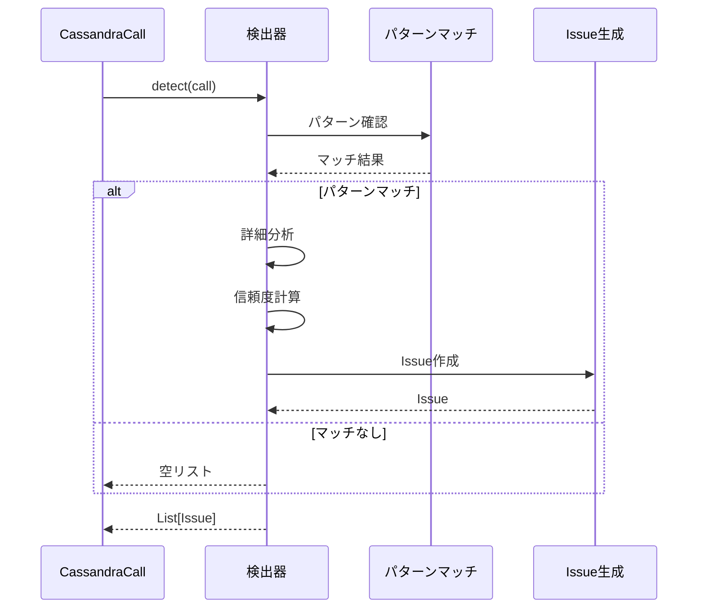
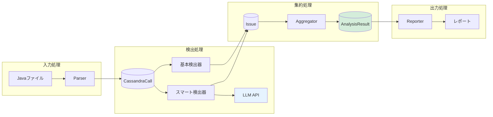
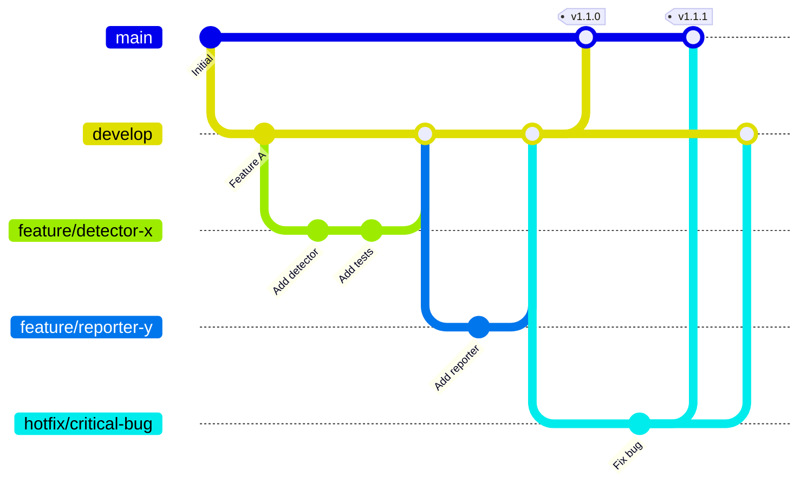
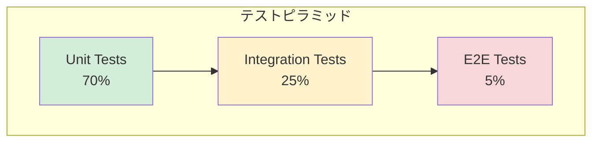

# DEVELOPMENT.md - 開発者ガイド

*バージョン: v2.0.0*
*最終更新: 2025年01月26日 20:55 JST*

Cassandra Code Analyzerの開発に参加するための包括的なガイドです。

## 目次

- [開発環境のセットアップ](#開発環境のセットアップ)
- [プロジェクト構成](#プロジェクト構成)
- [アーキテクチャ](#アーキテクチャ)
- [開発ワークフロー](#開発ワークフロー)
- [テスト](#テスト)
- [新機能の追加方法](#新機能の追加方法)
- [コーディング規約](#コーディング規約)
- [パフォーマンス最適化](#パフォーマンス最適化)
- [デバッグとプロファイリング](#デバッグとプロファイリング)
- [リリースプロセス](#リリースプロセス)

## 開発環境のセットアップ

### 前提条件

- Python 3.8以上
- pip（パッケージ管理）
- git
- Docker（オプション：テスト環境用）
- VSCode / PyCharm（推奨IDE）

### セットアップ手順

```bash
# 1. リポジトリのクローン
git clone https://github.com/your-org/cassandra-analyzer.git
cd cassandra-analyzer

# 2. 仮想環境の作成
python -m venv venv

# 3. 仮想環境の有効化
# Linux/Mac:
source venv/bin/activate
# Windows:
venv\Scripts\activate

# 4. 開発用依存パッケージのインストール
pip install -r requirements.txt
pip install -r requirements-dev.txt

# 5. 開発モードでインストール
pip install -e .

# 6. pre-commitフックのセットアップ
pre-commit install

# 7. テストの実行（環境確認）
pytest tests/ -v

# 8. 型チェック（環境確認）
mypy src/

# 9. リンター実行（環境確認）
ruff check .
```

### 開発ツール

推奨される開発ツール：

| ツール | 用途 | 設定 |
|--------|------|------|
| **Black** | コードフォーマッター | line-length=88 |
| **Ruff** | リンター | Python 3.8+ 互換 |
| **mypy** | 型チェッカー | strict mode |
| **pytest** | テストフレームワーク | coverage 95%+ |
| **pre-commit** | Git hooks | 自動品質チェック |

### VSCode設定例

`.vscode/settings.json`:

```json
{
  "python.linting.enabled": true,
  "python.linting.ruffEnabled": true,
  "python.formatting.provider": "black",
  "python.testing.pytestEnabled": true,
  "python.testing.unittestEnabled": false,
  "editor.formatOnSave": true,
  "editor.rulers": [88],
  "[python]": {
    "editor.defaultFormatter": "ms-python.black-formatter",
    "editor.codeActionsOnSave": {
      "source.organizeImports": true
    }
  },
  "python.analysis.typeCheckingMode": "strict"
}
```

### PyCharm設定

1. **Code Style**:
   - Settings → Editor → Code Style → Python
   - Right margin: 88
   - Use Black formatter

2. **Inspections**:
   - Enable mypy inspections
   - Enable Ruff inspections

3. **Test Runner**:
   - Settings → Tools → Python Integrated Tools
   - Default test runner: pytest

## プロジェクト構成

### ディレクトリ構造

```
cassandra-analyzer/
├── src/
│   └── cassandra_analyzer/
│       ├── __init__.py
│       ├── analyzer.py          # メインアナライザークラス
│       ├── cli.py               # CLIインターフェース
│       ├── models/              # データモデル
│       │   ├── __init__.py
│       │   ├── cassandra_call.py  # Cassandra呼び出し情報
│       │   ├── issue.py           # 検出された問題
│       │   └── analysis_result.py # 分析結果全体
│       ├── parsers/             # コードパーサー
│       │   ├── __init__.py
│       │   ├── base.py           # パーサー基底クラス
│       │   ├── java_parser.py    # Java正規表現パーサー
│       │   ├── ast_parser.py     # AST解析パーサー
│       │   └── cql_parser.py     # CQLクエリパーサー
│       ├── detectors/           # 問題検出器
│       │   ├── __init__.py
│       │   ├── base.py           # 検出器基底クラス
│       │   ├── allow_filtering.py
│       │   ├── partition_key.py
│       │   ├── batch_size.py
│       │   ├── prepared_statement.py
│       │   ├── smart_allow_filtering.py  # LLM統合
│       │   └── smart_partition_key.py    # LLM統合
│       ├── reporters/           # レポート生成
│       │   ├── __init__.py
│       │   ├── base.py           # レポーター基底クラス
│       │   ├── json_reporter.py
│       │   ├── markdown_reporter.py
│       │   └── html_reporter.py
│       ├── llm/                 # LLM統合
│       │   ├── __init__.py
│       │   ├── anthropic_client.py
│       │   ├── llm_analyzer.py
│       │   └── prompt_templates.py
│       ├── evaluation/          # 評価モジュール
│       │   ├── __init__.py
│       │   ├── evaluator.py
│       │   └── metrics.py
│       └── utils/               # ユーティリティ
│           ├── __init__.py
│           ├── cache.py
│           └── logger.py
├── tests/
│   ├── __init__.py
│   ├── conftest.py              # pytest設定
│   ├── fixtures/                # テスト用フィクスチャ
│   │   ├── sample_dao_good.java
│   │   ├── sample_dao_bad.java
│   │   └── test_data.json
│   ├── unit/                    # ユニットテスト
│   │   ├── test_parsers.py
│   │   ├── test_detectors.py
│   │   ├── test_reporters.py
│   │   └── test_llm.py
│   ├── integration/             # 統合テスト
│   │   ├── test_pipeline.py
│   │   └── test_llm_integration.py
│   └── e2e/                     # E2Eテスト
│       └── test_full_analysis.py
├── scripts/                     # 開発スクリプト
│   ├── generate_test_data.py
│   ├── benchmark.py
│   └── release.py
├── docs/                        # ドキュメント
│   ├── api/
│   ├── architecture/
│   └── examples/
├── .github/                     # GitHub Actions
│   └── workflows/
│       ├── ci.yml
│       ├── release.yml
│       └── codeql.yml
├── requirements.txt             # 本番依存パッケージ
├── requirements-dev.txt         # 開発依存パッケージ
├── setup.py                     # パッケージ設定
├── pyproject.toml               # プロジェクト設定
├── .pre-commit-config.yaml      # pre-commit設定
├── .gitignore
├── README.md
├── USAGE.md
├── DEVELOPMENT.md
└── LICENSE
```

## アーキテクチャ

### 設計原則

1. **単一責任の原則 (SRP)**: 各クラスは1つの責任のみを持つ
2. **開放閉鎖の原則 (OCP)**: 拡張に開き、修正に閉じる
3. **依存性逆転の原則 (DIP)**: 抽象に依存し、具象に依存しない
4. **インターフェース分離の原則 (ISP)**: クライアントが不要なメソッドに依存しない
5. **リスコフの置換原則 (LSP)**: 派生クラスは基底クラスと置換可能

### レイヤードアーキテクチャ



### コンポーネント設計

#### 1. Parser（パーサー）

**役割**: Javaソースコードを解析してCassandra関連の呼び出しを抽出

```python
from abc import ABC, abstractmethod
from typing import List
from cassandra_analyzer.models import CassandraCall

class BaseParser(ABC):
    """パーサーの基底クラス"""

    @abstractmethod
    def parse_file(self, file_path: str) -> List[CassandraCall]:
        """ファイルを解析してCassandra呼び出しを抽出"""
        pass

    @abstractmethod
    def parse_content(self, content: str, file_path: str) -> List[CassandraCall]:
        """コンテンツを解析"""
        pass

    def validate(self, call: CassandraCall) -> bool:
        """呼び出しの妥当性を検証"""
        return call.cql_text and call.line_number > 0
```

**実装クラス**:
- `JavaCassandraParser`: 正規表現ベース（高速）
- `ASTParser`: 抽象構文木解析（高精度）
- `CQLParser`: CQLクエリ専用パーサー

#### 2. Detector（検出器）

**役割**: Cassandra呼び出しから問題パターンを検出

```python
from abc import ABC, abstractmethod
from typing import List, Dict, Any, Optional
from cassandra_analyzer.models import CassandraCall, Issue

class BaseDetector(ABC):
    """検出器の基底クラス"""

    def __init__(self, config: Optional[Dict[str, Any]] = None):
        self.config = config or {}
        self.enabled = True
        self.severity_map = {
            "ALLOW_FILTERING": "high",
            "NO_PARTITION_KEY": "critical",
            "LARGE_BATCH": "medium",
            "NO_PREPARED_STMT": "low"
        }

    @abstractmethod
    def detect(self, call: CassandraCall) -> List[Issue]:
        """問題を検出"""
        pass

    def is_enabled(self) -> bool:
        """検出器が有効かどうか"""
        return self.enabled

    def calculate_confidence(self, evidence: List[str]) -> float:
        """信頼度を計算"""
        base_confidence = 0.8
        evidence_boost = len(evidence) * 0.05
        return min(base_confidence + evidence_boost, 1.0)
```

**検出器の実装フロー**:



#### 3. Reporter（レポーター）

**役割**: 分析結果を各種フォーマットで出力

```python
from abc import ABC, abstractmethod
from typing import Dict, Any
from cassandra_analyzer.models import AnalysisResult

class BaseReporter(ABC):
    """レポーターの基底クラス"""

    def __init__(self, config: Optional[Dict[str, Any]] = None):
        self.config = config or {}

    @property
    @abstractmethod
    def format_name(self) -> str:
        """フォーマット名"""
        pass

    @property
    @abstractmethod
    def file_extension(self) -> str:
        """ファイル拡張子"""
        pass

    @abstractmethod
    def generate(self, result: AnalysisResult) -> str:
        """レポートを生成"""
        pass

    def save(self, content: str, file_path: str) -> None:
        """レポートをファイルに保存"""
        with open(file_path, 'w', encoding='utf-8') as f:
            f.write(content)

    def generate_and_save(self, result: AnalysisResult, file_path: str) -> None:
        """生成して保存"""
        content = self.generate(result)
        self.save(content, file_path)
```

#### 4. LLM Integration（LLM統合）

**役割**: AIを活用した高度な分析

```python
from typing import Dict, Any, Optional
from dataclasses import dataclass

@dataclass
class LLMAnalysisRequest:
    """LLM分析リクエスト"""
    cql_query: str
    surrounding_code: str
    file_context: str
    analysis_type: str  # "allow_filtering" | "partition_key"

@dataclass
class LLMAnalysisResponse:
    """LLM分析レスポンス"""
    is_issue: bool
    confidence: float
    reasoning: str
    recommendation: Optional[str]
    evidence: List[str]

class LLMAnalyzer:
    """LLM分析エンジン"""

    def __init__(self, client: AnthropicClient, cache: Optional[Cache] = None):
        self.client = client
        self.cache = cache or InMemoryCache()
        self.prompt_templates = PromptTemplates()

    async def analyze(self, request: LLMAnalysisRequest) -> LLMAnalysisResponse:
        """LLMによる分析を実行"""
        # キャッシュチェック
        cache_key = self._generate_cache_key(request)
        if cached := self.cache.get(cache_key):
            return cached

        # プロンプト生成
        prompt = self.prompt_templates.build(request)

        # LLM呼び出し
        response = await self.client.complete(prompt)

        # レスポンス解析
        result = self._parse_response(response)

        # キャッシュ保存
        self.cache.set(cache_key, result)

        return result
```

### データフロー



## 開発ワークフロー

### ブランチ戦略



**ブランチ種類**:
- `main`: 本番リリース用
- `develop`: 開発用メインブランチ
- `feature/*`: 機能追加用
- `bugfix/*`: バグ修正用
- `hotfix/*`: 緊急修正用
- `release/*`: リリース準備用

### 開発フロー

```bash
# 1. 最新のdevelopを取得
git checkout develop
git pull origin develop

# 2. 機能ブランチを作成
git checkout -b feature/new-detector

# 3. 開発・テスト
# コードを書く
vim src/cassandra_analyzer/detectors/new_detector.py

# テストを書く
vim tests/unit/test_new_detector.py

# テスト実行
pytest tests/unit/test_new_detector.py -v

# 4. 品質チェック
black src/ tests/
ruff check .
mypy src/
pytest tests/ --cov=src/cassandra_analyzer

# 5. コミット
git add .
git commit -m "feat: Add new detector for X pattern

- Implement detection logic
- Add comprehensive tests
- Update documentation

Closes #123"

# 6. プッシュ
git push origin feature/new-detector

# 7. Pull Requestを作成
# GitHubでPRを作成し、レビューを依頼
```

### コミットメッセージ規約

Conventional Commitsに従う：

```
<type>(<scope>): <subject>

<body>

<footer>
```

**Type**:
- `feat`: 新機能
- `fix`: バグ修正
- `docs`: ドキュメント
- `style`: フォーマット
- `refactor`: リファクタリング
- `perf`: パフォーマンス改善
- `test`: テスト
- `chore`: その他
- `ci`: CI/CD関連

**例**:

```
feat(detector): Add timeout detection

Add detector for query timeout issues based on complexity analysis.
The detector analyzes CQL query complexity and estimates execution time.

- Implement timeout prediction algorithm
- Add configuration for timeout thresholds
- Include detailed recommendations

Closes #123
```

## テスト

### テスト戦略

**テストピラミッド**:



### テストの実行

```bash
# 全テスト実行
pytest tests/ -v

# 特定のテストファイルのみ
pytest tests/unit/test_detectors.py -v

# 特定のテストケースのみ
pytest tests/unit/test_detectors.py::TestAllowFilteringDetector::test_detect_allow_filtering -v

# カバレッジレポート
pytest tests/ --cov=src/cassandra_analyzer --cov-report=html --cov-report=term

# 並列実行（高速化）
pytest tests/ -n auto

# マーカー別実行
pytest tests/ -m "not slow"  # 遅いテストを除外
pytest tests/ -m "llm"  # LLMテストのみ

# 失敗したテストのみ再実行
pytest tests/ --lf

# 変更されたファイルに関連するテストのみ
pytest tests/ --testmon
```

### テスト作成ガイドライン

#### ユニットテストの例

```python
"""新しい検出器のテスト"""
import pytest
from unittest.mock import Mock, patch
from cassandra_analyzer.detectors import NewDetector
from cassandra_analyzer.models import CassandraCall, Issue

class TestNewDetector:
    """NewDetectorのテストクラス"""

    @pytest.fixture
    def detector(self):
        """検出器のフィクスチャ"""
        config = {"threshold": 100}
        return NewDetector(config=config)

    @pytest.fixture
    def sample_call(self):
        """サンプルCassandraCallのフィクスチャ"""
        return CassandraCall(
            file_path="test.java",
            line_number=10,
            method_name="execute",
            cql_text="SELECT * FROM users WHERE id = ?",
            query_type="SELECT",
            context={"method": "getUserById", "class": "UserDao"}
        )

    def test_detect_issue(self, detector, sample_call):
        """問題が検出されることを確認"""
        # Arrange
        sample_call.cql_text = "SELECT * FROM users WHERE email = ? ALLOW FILTERING"

        # Act
        issues = detector.detect(sample_call)

        # Assert
        assert len(issues) > 0
        assert issues[0].severity == "high"
        assert issues[0].issue_type == "NEW_ISSUE_TYPE"
        assert issues[0].confidence >= 0.8

    def test_no_issue(self, detector, sample_call):
        """問題がない場合"""
        # Act
        issues = detector.detect(sample_call)

        # Assert
        assert len(issues) == 0

    @pytest.mark.parametrize("cql,expected_count", [
        ("SELECT * FROM t WHERE pk = ?", 0),
        ("SELECT * FROM t WHERE ck = ? ALLOW FILTERING", 1),
        ("SELECT * FROM t", 1),
    ])
    def test_various_patterns(self, detector, sample_call, cql, expected_count):
        """様々なパターンのテスト"""
        sample_call.cql_text = cql
        issues = detector.detect(sample_call)
        assert len(issues) == expected_count

    @patch('cassandra_analyzer.detectors.new_detector.external_service')
    def test_with_mock(self, mock_service, detector, sample_call):
        """外部サービスをモックしたテスト"""
        # Arrange
        mock_service.return_value = {"result": "mocked"}

        # Act
        issues = detector.detect(sample_call)

        # Assert
        mock_service.assert_called_once()
        assert len(issues) >= 0
```

#### 統合テストの例

```python
"""パイプライン統合テスト"""
import pytest
from pathlib import Path
from cassandra_analyzer.analyzer import CassandraAnalyzer

class TestAnalysisPipeline:
    """分析パイプラインの統合テスト"""

    @pytest.fixture
    def analyzer(self):
        """アナライザーのフィクスチャ"""
        config = {
            "detectors": ["allow_filtering", "partition_key"],
            "llm": {"enabled": False}  # 統合テストではLLMを無効化
        }
        return CassandraAnalyzer(config=config)

    @pytest.fixture
    def test_file(self, tmp_path):
        """テスト用Javaファイルを生成"""
        file_path = tmp_path / "TestDao.java"
        file_path.write_text("""
        public class TestDao {
            public void query1() {
                session.execute("SELECT * FROM users WHERE email = ? ALLOW FILTERING", email);
            }

            public void query2() {
                session.execute("SELECT * FROM orders WHERE status = ?", status);
            }
        }
        """)
        return str(file_path)

    def test_full_analysis_pipeline(self, analyzer, test_file):
        """完全な分析パイプラインのテスト"""
        # Act
        result = analyzer.analyze_file(test_file)

        # Assert
        assert result.total_files == 1
        assert result.total_issues >= 2
        assert result.high_count >= 1  # ALLOW FILTERING
        assert result.critical_count >= 1  # No partition key

        # 詳細な検証
        issues_by_type = {}
        for issue in result.issues:
            issues_by_type.setdefault(issue.issue_type, []).append(issue)

        assert "ALLOW_FILTERING" in issues_by_type
        assert "NO_PARTITION_KEY" in issues_by_type
```

### カバレッジ目標

| カテゴリ | 目標 | 現在 |
|---------|------|------|
| 全体カバレッジ | > 80% | 95.34% |
| 新規コード | > 90% | - |
| Critical部分 | 100% | 100% |
| 検出器 | > 95% | 96.5% |
| パーサー | > 90% | 94.8% |
| レポーター | > 95% | 97.3% |

## 新機能の追加方法

### 新しい検出器の追加

1. **検出器クラスの作成**

```python
# src/cassandra_analyzer/detectors/timeout_detector.py
from typing import List, Dict, Any, Optional
from .base import BaseDetector
from cassandra_analyzer.models import CassandraCall, Issue
import re

class TimeoutDetector(BaseDetector):
    """クエリタイムアウトのリスクを検出"""

    def __init__(self, config: Optional[Dict[str, Any]] = None):
        super().__init__(config)
        self.complexity_threshold = self.config.get("complexity_threshold", 100)
        self.timeout_patterns = [
            r"SELECT \* FROM",  # 全件取得
            r"IN\s*\([^)]{100,}\)",  # 大量のIN句
            r"JOIN",  # JOINは非推奨
        ]

    def detect(self, call: CassandraCall) -> List[Issue]:
        """タイムアウトリスクを検出"""
        issues = []

        complexity = self._calculate_complexity(call.cql_text)
        if complexity > self.complexity_threshold:
            issue = Issue(
                detector_name=self.__class__.__name__,
                issue_type="TIMEOUT_RISK",
                severity="high",
                file_path=call.file_path,
                line_number=call.line_number,
                message=f"Query may timeout (complexity: {complexity})",
                cql_text=call.cql_text,
                recommendation="Consider adding LIMIT, using partition key, or breaking into smaller queries",
                evidence=[
                    f"Complexity score: {complexity}",
                    f"Threshold: {self.complexity_threshold}"
                ],
                confidence=min(complexity / 200, 1.0)
            )
            issues.append(issue)

        return issues

    def _calculate_complexity(self, cql: str) -> int:
        """クエリの複雑度を計算"""
        complexity = 0

        # パターンマッチによる複雑度計算
        for pattern in self.timeout_patterns:
            if re.search(pattern, cql, re.IGNORECASE):
                complexity += 50

        # 文字数による複雑度
        complexity += len(cql) // 10

        return complexity
```

2. **テストの作成**

```python
# tests/unit/test_timeout_detector.py
import pytest
from cassandra_analyzer.detectors.timeout_detector import TimeoutDetector
from cassandra_analyzer.models import CassandraCall

class TestTimeoutDetector:
    """TimeoutDetectorのテスト"""

    @pytest.fixture
    def detector(self):
        return TimeoutDetector(config={"complexity_threshold": 100})

    def test_detect_complex_query(self, detector):
        """複雑なクエリを検出"""
        call = CassandraCall(
            file_path="test.java",
            line_number=10,
            method_name="execute",
            cql_text="SELECT * FROM large_table WHERE id IN (" + ",".join(["?"] * 100) + ")",
            query_type="SELECT"
        )

        issues = detector.detect(call)
        assert len(issues) > 0
        assert issues[0].issue_type == "TIMEOUT_RISK"

    def test_simple_query_no_issue(self, detector):
        """単純なクエリは問題なし"""
        call = CassandraCall(
            file_path="test.java",
            line_number=10,
            method_name="execute",
            cql_text="SELECT * FROM users WHERE id = ?",
            query_type="SELECT"
        )

        issues = detector.detect(call)
        assert len(issues) == 0
```

3. **検出器の登録**

```python
# src/cassandra_analyzer/detectors/__init__.py
from .timeout_detector import TimeoutDetector

__all__ = [
    # ... 既存の検出器
    "TimeoutDetector",
]
```

4. **アナライザーへの統合**

```python
# src/cassandra_analyzer/analyzer.py
from cassandra_analyzer.detectors import TimeoutDetector

def _initialize_detectors(self) -> List[BaseDetector]:
    """検出器を初期化"""
    # ... 既存のコード

    if "timeout" in enabled_detectors:
        config = detector_configs.get("timeout", {})
        detectors.append(TimeoutDetector(config=config))

    return detectors
```

### 新しいレポーターの追加

1. **レポータークラスの作成**

```python
# src/cassandra_analyzer/reporters/csv_reporter.py
import csv
from io import StringIO
from typing import Dict, Any, Optional
from .base import BaseReporter
from cassandra_analyzer.models import AnalysisResult

class CSVReporter(BaseReporter):
    """CSV形式のレポーター"""

    @property
    def format_name(self) -> str:
        return "CSV"

    @property
    def file_extension(self) -> str:
        return ".csv"

    def generate(self, result: AnalysisResult) -> str:
        """CSV形式のレポートを生成"""
        output = StringIO()
        writer = csv.DictWriter(
            output,
            fieldnames=["file", "line", "severity", "type", "message", "recommendation"]
        )

        writer.writeheader()
        for issue in result.issues:
            writer.writerow({
                "file": issue.file_path,
                "line": issue.line_number,
                "severity": issue.severity,
                "type": issue.issue_type,
                "message": issue.message,
                "recommendation": issue.recommendation
            })

        return output.getvalue()
```

### 新しいパーサーの追加

1. **パーサークラスの作成**

```python
# src/cassandra_analyzer/parsers/kotlin_parser.py
from typing import List
import re
from .base import BaseParser
from cassandra_analyzer.models import CassandraCall

class KotlinParser(BaseParser):
    """Kotlin用パーサー"""

    def parse_file(self, file_path: str) -> List[CassandraCall]:
        """Kotlinファイルを解析"""
        with open(file_path, 'r', encoding='utf-8') as f:
            content = f.read()
        return self.parse_content(content, file_path)

    def parse_content(self, content: str, file_path: str) -> List[CassandraCall]:
        """コンテンツを解析"""
        calls = []

        # Kotlin特有のパターン
        patterns = [
            r'session\.execute\s*\(\s*"([^"]+)"',  # 文字列リテラル
            r'session\.execute\s*\(\s*"""([^"]+)"""',  # 生文字列
            r'session\.executeAsync\s*\(\s*"([^"]+)"',
        ]

        lines = content.split('\n')
        for line_num, line in enumerate(lines, 1):
            for pattern in patterns:
                matches = re.findall(pattern, line)
                for cql in matches:
                    call = CassandraCall(
                        file_path=file_path,
                        line_number=line_num,
                        method_name="execute",
                        cql_text=cql.strip(),
                        query_type=self._detect_query_type(cql)
                    )
                    if self.validate(call):
                        calls.append(call)

        return calls
```

## コーディング規約

### Python Style Guide

**基本規約**:
- **PEP 8**に準拠
- **行の長さ**: 88文字（Black準拠）
- **インデント**: 4スペース
- **クォート**: ダブルクォート `"` を推奨

### 型ヒント

すべての関数・メソッドに型ヒントを付与：

```python
from typing import List, Dict, Optional, Union, Tuple, Any
from pathlib import Path

def analyze_file(
    self,
    file_path: Union[str, Path],
    config: Optional[Dict[str, Any]] = None
) -> AnalysisResult:
    """ファイルを分析

    Args:
        file_path: 分析対象のファイルパス
        config: オプション設定

    Returns:
        分析結果

    Raises:
        FileNotFoundError: ファイルが存在しない場合
        AnalysisError: 分析中にエラーが発生した場合
    """
    pass

def process_data(
    items: List[str],
    config: Dict[str, Any],
    threshold: Optional[int] = None
) -> Tuple[int, List[Issue]]:
    """データを処理"""
    pass
```

### Docstring

Google Styleを使用：

```python
def detect(self, call: CassandraCall) -> List[Issue]:
    """Cassandra呼び出しから問題を検出

    CQLクエリを解析し、パフォーマンス問題やアンチパターンを検出する。
    検出された各問題には重要度と推奨事項が含まれる。

    Args:
        call: Cassandra呼び出し情報
            - file_path: ソースファイルパス
            - line_number: 行番号
            - cql_text: CQLクエリテキスト

    Returns:
        検出された問題のリスト。問題がない場合は空リスト。

    Raises:
        ValueError: 無効な呼び出し情報の場合
        AnalysisError: 分析中にエラーが発生した場合

    Examples:
        >>> detector = AllowFilteringDetector()
        >>> call = CassandraCall(
        ...     file_path="dao.java",
        ...     line_number=10,
        ...     cql_text="SELECT * FROM users ALLOW FILTERING"
        ... )
        >>> issues = detector.detect(call)
        >>> len(issues)
        1
    """
    pass
```

### 命名規則

| 要素 | 規則 | 例 |
|------|------|-----|
| クラス | PascalCase | `CassandraAnalyzer` |
| 関数/メソッド | snake_case | `detect_issues()` |
| 定数 | UPPER_SNAKE_CASE | `MAX_BATCH_SIZE` |
| プライベート | アンダースコアプレフィックス | `_internal_method()` |
| パッケージ | lowercase | `cassandraanalyzer` |
| モジュール | snake_case | `java_parser.py` |

### インポート順序

```python
# 1. 標準ライブラリ
import os
import sys
from pathlib import Path
from typing import List, Dict, Optional

# 2. サードパーティ
import pytest
import pandas as pd
from anthropic import Anthropic

# 3. ローカルパッケージ
from cassandra_analyzer.models import Issue
from cassandra_analyzer.detectors.base import BaseDetector
from .utils import calculate_confidence
```

## パフォーマンス最適化

### プロファイリング

```python
# scripts/benchmark.py
import cProfile
import pstats
from cassandra_analyzer.analyzer import CassandraAnalyzer

def profile_analysis():
    """分析のプロファイリング"""
    analyzer = CassandraAnalyzer()

    # プロファイリング実行
    profiler = cProfile.Profile()
    profiler.enable()

    result = analyzer.analyze_directory("./test_data")

    profiler.disable()

    # 結果の表示
    stats = pstats.Stats(profiler)
    stats.sort_stats('cumulative')
    stats.print_stats(20)

    # ボトルネックの特定
    stats.sort_stats('time')
    stats.print_stats(10)

if __name__ == "__main__":
    profile_analysis()
```

### 最適化テクニック

1. **キャッシング**

```python
from functools import lru_cache
from typing import Dict, Any

class OptimizedDetector(BaseDetector):

    @lru_cache(maxsize=1000)
    def _compile_pattern(self, pattern: str) -> re.Pattern:
        """パターンをコンパイル（キャッシュ付き）"""
        return re.compile(pattern, re.IGNORECASE)

    def detect(self, call: CassandraCall) -> List[Issue]:
        pattern = self._compile_pattern(r"ALLOW\s+FILTERING")
        # パターンを使用
```

2. **並列処理**

```python
from concurrent.futures import ThreadPoolExecutor, as_completed
from typing import List

class ParallelAnalyzer:

    def analyze_files_parallel(self, file_paths: List[str]) -> AnalysisResult:
        """ファイルを並列で分析"""
        with ThreadPoolExecutor(max_workers=4) as executor:
            futures = {
                executor.submit(self._analyze_single, path): path
                for path in file_paths
            }

            results = []
            for future in as_completed(futures):
                try:
                    result = future.result()
                    results.append(result)
                except Exception as e:
                    print(f"Error analyzing {futures[future]}: {e}")

        return self._merge_results(results)
```

3. **メモリ効率化**

```python
def parse_large_file(file_path: str) -> Generator[CassandraCall, None, None]:
    """大きなファイルを効率的に解析"""
    with open(file_path, 'r', encoding='utf-8') as f:
        for line_num, line in enumerate(f, 1):
            # 1行ずつ処理（メモリ効率的）
            if match := pattern.search(line):
                yield CassandraCall(
                    file_path=file_path,
                    line_number=line_num,
                    cql_text=match.group(1)
                )
```

## デバッグとプロファイリング

### デバッグツール

1. **ロギング設定**

```python
# src/cassandra_analyzer/utils/logger.py
import logging
from typing import Optional

def setup_logger(
    name: str,
    level: int = logging.INFO,
    log_file: Optional[str] = None
) -> logging.Logger:
    """ロガーをセットアップ"""
    logger = logging.getLogger(name)
    logger.setLevel(level)

    # コンソールハンドラー
    console = logging.StreamHandler()
    console.setLevel(level)
    console_format = logging.Formatter(
        '%(asctime)s - %(name)s - %(levelname)s - %(message)s'
    )
    console.setFormatter(console_format)
    logger.addHandler(console)

    # ファイルハンドラー
    if log_file:
        file_handler = logging.FileHandler(log_file)
        file_handler.setLevel(logging.DEBUG)
        file_format = logging.Formatter(
            '%(asctime)s - %(name)s - %(levelname)s - %(filename)s:%(lineno)d - %(message)s'
        )
        file_handler.setFormatter(file_format)
        logger.addHandler(file_handler)

    return logger

# 使用例
logger = setup_logger(__name__, logging.DEBUG, "debug.log")
logger.debug("Starting analysis...")
```

2. **デバッグモード**

```python
class CassandraAnalyzer:

    def __init__(self, config: Optional[Dict[str, Any]] = None, debug: bool = False):
        self.debug = debug
        if self.debug:
            self.logger.setLevel(logging.DEBUG)

    def analyze_file(self, file_path: str) -> AnalysisResult:
        if self.debug:
            self.logger.debug(f"Analyzing file: {file_path}")
            start_time = time.time()

        # 分析処理

        if self.debug:
            elapsed = time.time() - start_time
            self.logger.debug(f"Analysis completed in {elapsed:.2f}s")
```

### メモリプロファイリング

```python
# scripts/memory_profile.py
from memory_profiler import profile
from cassandra_analyzer.analyzer import CassandraAnalyzer

@profile
def analyze_with_memory_profile():
    """メモリ使用量をプロファイル"""
    analyzer = CassandraAnalyzer()
    result = analyzer.analyze_directory("./large_dataset")
    return result

if __name__ == "__main__":
    result = analyze_with_memory_profile()
    print(f"Total issues: {result.total_issues}")
```

## リリースプロセス

### バージョニング

Semantic Versioningを使用：

```
MAJOR.MINOR.PATCH
```

- **MAJOR**: 後方互換性のない変更
- **MINOR**: 後方互換性のある機能追加
- **PATCH**: 後方互換性のあるバグ修正

### リリース手順

```bash
# 1. developブランチで最終確認
git checkout develop
pytest tests/ -v
make check

# 2. リリースブランチ作成
git checkout -b release/v1.2.0

# 3. バージョン更新
# setup.py, pyproject.toml, __init__.pyのバージョンを更新
vim setup.py
vim pyproject.toml
vim src/cassandra_analyzer/__init__.py

# 4. CHANGELOGの更新
vim CHANGELOG.md

# 5. コミット
git add .
git commit -m "chore: Prepare release v1.2.0"

# 6. mainにマージ
git checkout main
git merge --no-ff release/v1.2.0

# 7. タグ作成
git tag -a v1.2.0 -m "Release version 1.2.0

Features:
- Add timeout detector
- Improve LLM integration

Fixes:
- Fix partition key detection
- Improve error handling"

# 8. developにマージバック
git checkout develop
git merge --no-ff release/v1.2.0

# 9. プッシュ
git push origin main develop --tags

# 10. GitHubでリリース作成
gh release create v1.2.0 \
  --title "v1.2.0: Timeout Detection & LLM Improvements" \
  --notes-file RELEASE_NOTES.md

# 11. PyPIへのパブリッシュ（オプション）
python setup.py sdist bdist_wheel
twine upload dist/*
```

### CI/CDパイプライン

```yaml
# .github/workflows/release.yml
name: Release

on:
  push:
    tags:
      - 'v*'

jobs:
  release:
    runs-on: ubuntu-latest

    steps:
    - uses: actions/checkout@v2

    - name: Set up Python
      uses: actions/setup-python@v2
      with:
        python-version: '3.9'

    - name: Install dependencies
      run: |
        pip install --upgrade pip
        pip install setuptools wheel twine
        pip install -r requirements.txt

    - name: Run tests
      run: |
        pytest tests/ --cov=src/cassandra_analyzer

    - name: Build distribution
      run: |
        python setup.py sdist bdist_wheel

    - name: Check distribution
      run: |
        twine check dist/*

    - name: Publish to PyPI
      env:
        TWINE_USERNAME: __token__
        TWINE_PASSWORD: ${{ secrets.PYPI_API_TOKEN }}
      run: |
        twine upload dist/*

    - name: Create GitHub Release
      uses: softprops/action-gh-release@v1
      with:
        files: dist/*
        generate_release_notes: true
```

## トラブルシューティング

### よくある問題と解決方法

**問題**: テストが失敗する

```bash
# キャッシュをクリア
pytest --cache-clear tests/

# 依存関係を再インストール
pip install -r requirements.txt --force-reinstall

# 仮想環境を再作成
deactivate
rm -rf venv/
python -m venv venv
source venv/bin/activate
pip install -r requirements.txt
pip install -e .
```

**問題**: 型チェックエラー

```bash
# mypyキャッシュをクリア
mypy --clear-cache src/

# 型スタブをインストール
pip install types-requests types-pyyaml
```

**問題**: import エラー

```bash
# 開発モードで再インストール
pip install -e .

# PYTHONPATHを設定
export PYTHONPATH="${PYTHONPATH}:$(pwd)/src"
```

**問題**: LLM APIタイムアウト

```python
# タイムアウト設定を増やす
config = {
    "llm": {
        "timeout": 60,  # 60秒に増加
        "retry_count": 5,
        "retry_delay": 2
    }
}
```

## コントリビューション

コントリビューションは大歓迎です！

1. Issueで議論
2. Forkしてfeatureブランチを作成
3. 変更をコミット（テスト含む）
4. Pull Requestを作成

### コントリビューションチェックリスト

- [ ] コードがPEP 8に準拠している
- [ ] 型ヒントが完備している
- [ ] テストが追加されている
- [ ] テストカバレッジが低下していない
- [ ] ドキュメントが更新されている
- [ ] CHANGELOGにエントリを追加した
- [ ] pre-commitフックを通過している

## リソース

- [Python公式ドキュメント](https://docs.python.org/3/)
- [pytest公式ドキュメント](https://docs.pytest.org/)
- [PEP 8 Style Guide](https://pep8.org/)
- [Type Hints (PEP 484)](https://www.python.org/dev/peps/pep-0484/)
- [Apache Cassandra Documentation](https://cassandra.apache.org/doc/latest/)
- [Anthropic Claude API](https://docs.anthropic.com/)

---

*最終更新: 2025年01月26日 20:55 JST*
*バージョン: v2.0.0*

**更新履歴:**
- v2.0.0 (2025年01月26日): mermaid図追加、LLM統合詳細、パフォーマンス最適化セクション追加