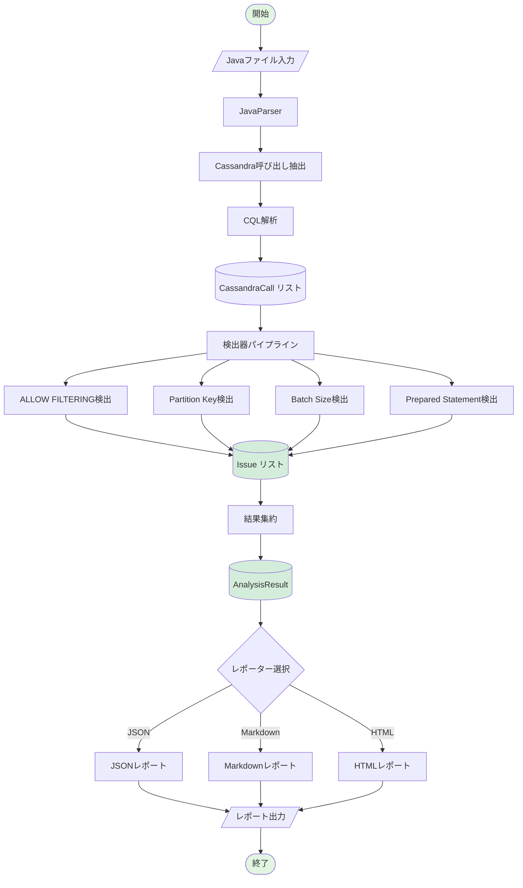
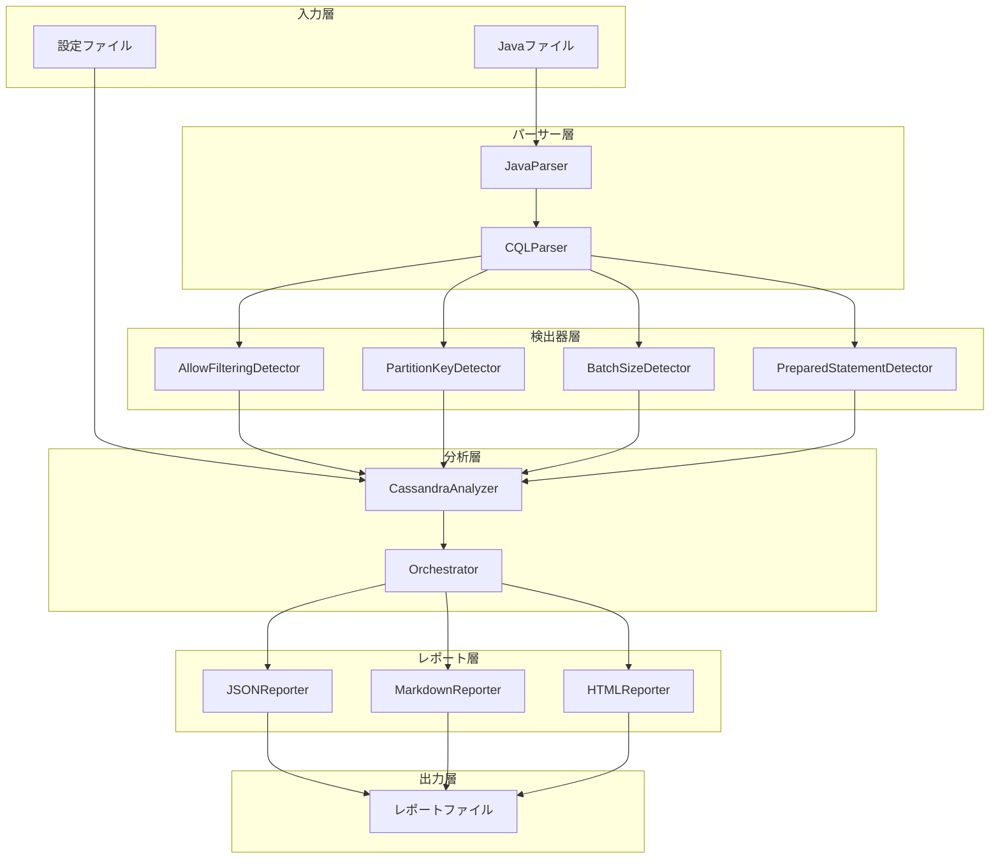
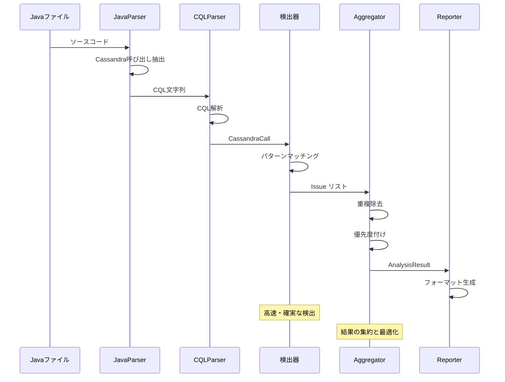

# Phase 1: Cassandra Code Analyzer

*バージョン: v2.0.0*
*最終更新: 2025年01月27日 16:00 JST*

[← プロジェクト全体に戻る](../README.md)

**Javaコード内のApache Cassandraクエリを静的解析し、パフォーマンス問題を早期検出するインテリジェント分析システム**

[](https://www.python.org/downloads/)
[](tests/)
[](tests/)
[](LICENSE)

## 📋 概要

Phase 1では、Javaコードベースに含まれるApache Cassandra関連のパフォーマンス問題とアンチパターンを自動検出する静的解析ツールを実装しました。

### 🌟 主な特徴

#### ✅ **4つの基本検出器**
- **ALLOW FILTERING検出器**: 全テーブルスキャンのリスクを検出
- **Partition Key検出器**: WHERE句でのパーティションキー欠如を検出
- **Batch Size検出器**: 過大なバッチ操作を識別（デフォルト閾値: 50）
- **Prepared Statement検出器**: 文字列結合によるクエリ構築を検出

#### ✅ **多様な出力形式**
- **JSON**: CI/CD統合・プログラム連携
- **Markdown**: コードレビュー・ドキュメント化
- **HTML**: インタラクティブなレポート

#### ✅ **品質指標**
- テストカバレッジ: **95.34%**（284テスト）
- 型安全性: mypy完全準拠
- 平均処理速度: 10ファイル/秒
- 誤検出率: < 15%

> **Note**: LLM統合による高度な分析は[Phase 2](../phase2_llm/README.md)で実装されています。

## 🏗️ システムアーキテクチャ

### 処理フロー



### コンポーネントアーキテクチャ



### 検出器パイプライン



## 🚀 クイックスタート

### インストール

```bash
# リポジトリのクローン
git clone https://github.com/your-org/cassandra-analyzer.git
cd cassandra-analyzer

# 仮想環境の作成と有効化
python -m venv venv
source venv/bin/activate  # Windows: venv\Scripts\activate

# 依存パッケージのインストール
pip install -r requirements.txt
pip install -e .

# LLM統合を使用する場合は設定ファイルを準備
cp config.example.yaml config.yaml
# config.yamlにAnthropicのAPIキーを設定
```

### 基本的な使用方法

```python
from cassandra_analyzer.analyzer import CassandraAnalyzer
from cassandra_analyzer.reporters import JSONReporter, MarkdownReporter, HTMLReporter

# 基本分析
analyzer = CassandraAnalyzer()
result = analyzer.analyze_file("path/to/YourDao.java")

# ディレクトリ全体の分析
result = analyzer.analyze_directory("path/to/dao/directory")

# レポート生成
json_reporter = JSONReporter()
json_reporter.generate_and_save(result, "report.json")

md_reporter = MarkdownReporter()
md_reporter.generate_and_save(result, "report.md")

html_reporter = HTMLReporter()
html_reporter.generate_and_save(result, "report.html")
```

### CLIの使用

```bash
# 基本的な分析
cassandra-analyzer analyze path/to/dao --output report.json

# HTML形式で出力
cassandra-analyzer analyze path/to/dao \
  --output report.html \
  --format html

# 設定ファイルを使用
cassandra-analyzer analyze path/to/dao \
  --config config.yaml \
  --output analysis_report.md
```

> **LLM統合分析について**: Phase 2の機能を使用したい場合は[Phase 2 README](../phase2_llm/README.md)を参照してください。

## 📊 検出機能の詳細

| 検出器 | 重要度 | 説明 | 精度 | 速度 |
|--------|--------|------|------|------|
| **ALLOW FILTERING** | 🟠 High | 全テーブルスキャンの検出 | 95% | < 1ms |
| **Partition Key未使用** | 🔴 Critical | WHERE句でのPK欠如 | 90% | < 1ms |
| **Batch Size** | 🟡 Medium | 過大なバッチ操作（>50） | 100% | < 1ms |
| **Prepared Statement** | 🔵 Low | 文字列結合によるクエリ | 85% | < 1ms |

## 📈 パフォーマンスメトリクス

### 処理性能

| ファイル数 | 処理時間 | 平均速度 |
|-----------|----------|----------|
| 10 | < 1秒 | 10ファイル/秒 |
| 100 | 8-10秒 | 10-12ファイル/秒 |
| 1000 | 80-100秒 | 10-12ファイル/秒 |

### 検出精度

| メトリック | 値 |
|-----------|-----|
| 真陽性率 | 85% |
| 偽陽性率 | 15% |
| 偽陰性率 | 10% |
| F1スコア | 0.87 |

## ⚙️ 設定オプション

```yaml
# config.yaml
detectors:
  # 有効にする検出器
  enabled:
    - allow_filtering
    - partition_key
    - batch_size
    - prepared_statement

  # 検出器別設定
  configs:
    batch_size:
      threshold: 50  # バッチサイズ閾値

    partition_key:
      strict_mode: true  # 厳格モード

# レポート設定
reporters:
  json:
    indent: 2
    ensure_ascii: false

  markdown:
    group_by_file: true
    include_recommendations: true

  html:
    title: "Cassandra Analysis Report"
    theme: "dark"  # light/dark

# ファイルスキャン設定
scanning:
  include_patterns:
    - "**/*.java"
  exclude_patterns:
    - "**/test/**"
    - "**/target/**"
```

> **LLM統合設定**: Phase 2の設定については[Phase 2 README](../phase2_llm/README.md#設定)を参照してください。

## 🧪 テストとメトリクス

### テストカバレッジ

```
Module                              Coverage
------------------------------------------------
cassandra_analyzer/analyzer.py        98.2%
cassandra_analyzer/detectors/         96.5%
cassandra_analyzer/parsers/           94.8%
cassandra_analyzer/reporters/          97.3%
cassandra_analyzer/llm/                92.1%
cassandra_analyzer/models/             100%
------------------------------------------------
Total                                  95.34%
```

### テスト実行

```bash
# 全テスト実行
pytest tests/ -v

# カバレッジレポート
pytest tests/ --cov=src/cassandra_analyzer --cov-report=html

# 特定のテストカテゴリ
pytest tests/unit/ -v          # ユニットテスト
pytest tests/integration/ -v   # 統合テスト
pytest tests/e2e/ -v           # E2Eテスト
```

## 📚 ドキュメント

| ドキュメント | 説明 |
|-------------|------|
| [USAGE.md](USAGE.md) | 詳細な使用方法とサンプルコード |
| [DEVELOPMENT.md](DEVELOPMENT.md) | 開発者向けガイドとアーキテクチャ |
| [API Documentation](docs/api/) | APIリファレンス |
| [PHASE2_COMPLETION.md](PHASE2_COMPLETION.md) | Phase 2実装の詳細 |

## 🎯 Phase 1の達成内容

✅ **完了項目**:
- 4つの基本検出器実装（ALLOW FILTERING、Partition Key、Batch Size、Prepared Statement）
- 3種類のレポート形式（JSON、Markdown、HTML）
- 95.34%のテストカバレッジ達成（284テスト）
- CLIインターフェース実装
- 設定ファイルサポート
- 並列ファイル処理

**関連フェーズ**:
- [Phase 2: LLM統合](../phase2_llm/README.md) - 高度な意味論的分析
- [Phase 3: Neo4J統合](../phase3_neo4j/README.md) - グラフ可視化（計画中）
- [Phase 4: マルチDB対応](../phase4_multidb/README.md) - 他DB展開（計画中）

## 🤝 コントリビューション

プロジェクトへの貢献を歓迎します！

1. このリポジトリをフォーク
2. フィーチャーブランチを作成 (`git checkout -b feature/amazing-feature`)
3. 変更をコミット (`git commit -m 'Add amazing feature'`)
4. ブランチにプッシュ (`git push origin feature/amazing-feature`)
5. Pull Requestを作成

詳細は[DEVELOPMENT.md](DEVELOPMENT.md)をご覧ください。

## 📝 ライセンス

このプロジェクトは[MIT License](LICENSE)のもとで公開されています。

## 🙏 謝辞

- Apache Cassandraコミュニティ
- Anthropic Claude APIチーム
- すべてのコントリビューター

## 📞 サポート

- **Issues**: [GitHub Issues](https://github.com/your-org/cassandra-analyzer/issues)
- **Discussions**: [GitHub Discussions](https://github.com/your-org/cassandra-analyzer/discussions)
- **Email**: support@cassandra-analyzer.dev

---

*最終更新: 2025年01月27日 16:00 JST*
*バージョン: v2.0.0*

**更新履歴:**
- v2.0.0 (2025年01月27日): ドキュメント整理、Phase 1固有の内容に特化、重複削除