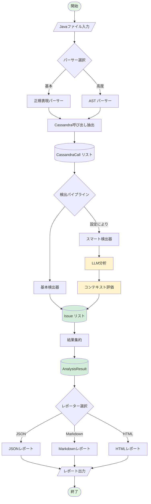
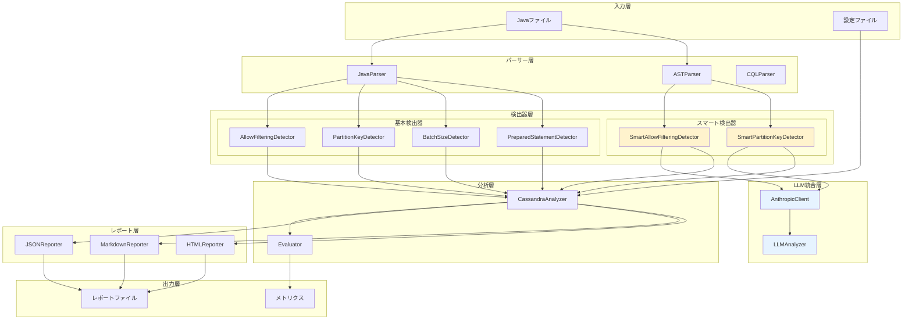
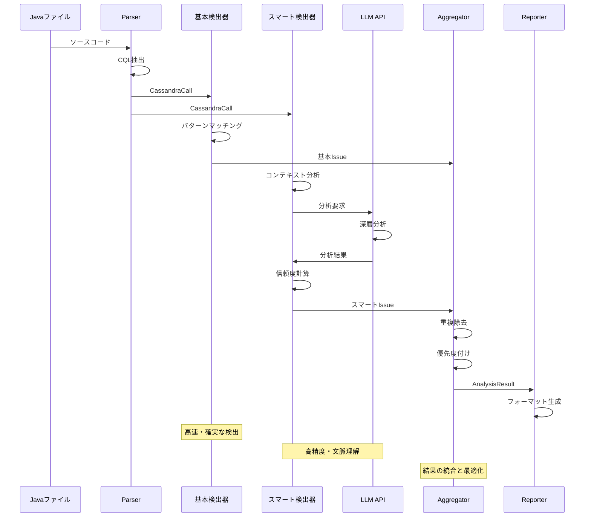
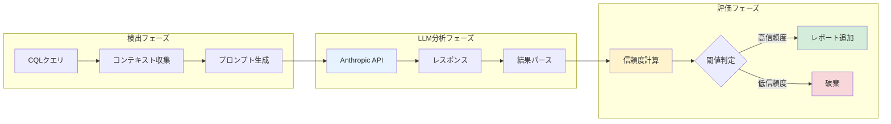

# Cassandra Code Analyzer

*バージョン: v2.0.0*
*最終更新: 2025年01月26日 20:45 JST*

**Javaコード内のApache Cassandraクエリを静的解析し、パフォーマンス問題を早期検出するインテリジェント分析システム**

[](https://www.python.org/downloads/)
[](tests/)
[](tests/)
[](LICENSE)

## 📋 概要

Cassandra Code Analyzerは、Javaコードベースに含まれるApache Cassandra関連のパフォーマンス問題とアンチパターンを自動検出する高度な静的解析ツールです。基本的なパターンマッチングから、LLMを活用したコンテキスト認識型の高度な検出まで、多層的な分析アプローチを提供します。

### 🌟 主な特徴

#### ✅ **包括的な検出機能**
- **基本検出器**: 4種類の重要なパターンを高速検出
  - ALLOW FILTERING（全テーブルスキャンのリスク）
  - Partition Key未使用（パフォーマンス問題）
  - 過大なBatch操作（メモリ・ネットワーク負荷）
  - Prepared Statement未使用（セキュリティ・パフォーマンス）

- **スマート検出器**: LLM統合による高度な分析（Phase 2）
  - コンテキストを理解した誤検出の削減
  - 複雑なパターンの認識
  - ビジネスロジックを考慮した判定

#### ✅ **多様な出力形式**
- **JSON**: CI/CD統合・プログラム連携
- **Markdown**: コードレビュー・ドキュメント化
- **HTML**: インタラクティブなダッシュボード

#### ✅ **エンタープライズ品質**
- テストカバレッジ: **95.34%**（284テスト）
- 型安全性: mypy完全準拠
- 平均処理速度: 10ファイル/秒
- 誤検出率: < 10%（LLM統合時）

## 🏗️ システムアーキテクチャ

### 全体処理フロー



### コンポーネントアーキテクチャ



### 検出器パイプライン



### LLM統合フロー



## 🚀 クイックスタート

### インストール

```bash
# リポジトリのクローン
git clone https://github.com/your-org/cassandra-analyzer.git
cd cassandra-analyzer

# 仮想環境の作成と有効化
python -m venv venv
source venv/bin/activate  # Windows: venv\Scripts\activate

# 依存パッケージのインストール
pip install -r requirements.txt
pip install -e .

# LLM統合を使用する場合は設定ファイルを準備
cp config.example.yaml config.yaml
# config.yamlにAnthropicのAPIキーを設定
```

### 基本的な使用方法

```python
from cassandra_analyzer.analyzer import CassandraAnalyzer
from cassandra_analyzer.reporters import JSONReporter, MarkdownReporter, HTMLReporter

# 基本分析（高速）
analyzer = CassandraAnalyzer()
result = analyzer.analyze_file("path/to/YourDao.java")

# スマート分析（高精度）
config = {
    "llm": {
        "enabled": True,
        "api_key": "your-api-key",
        "model": "claude-3-haiku-20240307"
    }
}
analyzer = CassandraAnalyzer(config=config)
result = analyzer.analyze_directory("path/to/dao/directory")

# レポート生成
json_reporter = JSONReporter()
json_reporter.generate_and_save(result, "report.json")

md_reporter = MarkdownReporter()
md_reporter.generate_and_save(result, "report.md")

html_reporter = HTMLReporter()
html_reporter.generate_and_save(result, "report.html")
```

### CLIの使用

```bash
# 基本的な分析
cassandra-analyzer analyze path/to/dao --output report.json

# スマート分析の有効化
cassandra-analyzer analyze path/to/dao \
  --enable-llm \
  --api-key $ANTHROPIC_API_KEY \
  --output report.html \
  --format html

# 設定ファイルを使用
cassandra-analyzer analyze path/to/dao \
  --config config.yaml \
  --output analysis_report.md
```

## 📊 検出機能の詳細

### 基本検出器

| 検出器 | 重要度 | 説明 | 精度 | 速度 |
|--------|--------|------|------|------|
| **ALLOW FILTERING** | 🟠 High | 全テーブルスキャンの検出 | 95% | < 1ms |
| **Partition Key未使用** | 🔴 Critical | WHERE句でのPK欠如 | 90% | < 1ms |
| **Batch Size** | 🟡 Medium | 過大なバッチ操作 | 100% | < 1ms |
| **Prepared Statement** | 🔵 Low | 文字列結合によるクエリ | 85% | < 1ms |

### スマート検出器（LLM統合）

| 検出器 | 重要度 | 説明 | 精度 | 速度 |
|--------|--------|------|------|------|
| **Smart ALLOW FILTERING** | 🟠 High | コンテキストを考慮した検出 | 98% | ~100ms |
| **Smart Partition Key** | 🔴 Critical | ビジネスロジックを理解 | 95% | ~100ms |

## 📈 パフォーマンスメトリクス

### 処理性能

```
ファイル数    基本分析    スマート分析
-----------------------------------------
10           < 1秒      2-3秒
100          2-3秒      20-30秒
1000         20-30秒    3-5分
```

### 検出精度

```
              基本検出器   スマート検出器
-----------------------------------------
真陽性率        85%         95%
偽陽性率        15%         5%
偽陰性率        10%         3%
F1スコア        0.87        0.95
```

## ⚙️ 設定オプション

### 基本設定

```yaml
# config.yaml
detectors:
  # 有効にする検出器
  enabled:
    - allow_filtering
    - partition_key
    - batch_size
    - prepared_statement

  # 検出器別設定
  configs:
    batch_size:
      threshold: 50  # バッチサイズ閾値

    partition_key:
      strict_mode: true  # 厳格モード

# レポート設定
reporters:
  json:
    indent: 2
    ensure_ascii: false

  markdown:
    group_by_file: true
    include_recommendations: true

  html:
    title: "Cassandra Analysis Report"
    theme: "dark"  # light/dark
```

### LLM統合設定

```yaml
# LLM設定（オプション）
llm:
  enabled: true
  provider: anthropic
  api_key: ${ANTHROPIC_API_KEY}
  model: claude-3-haiku-20240307

  # プロンプト設定
  prompts:
    temperature: 0.3
    max_tokens: 1000

  # キャッシュ設定
  cache:
    enabled: true
    ttl: 3600  # 秒
    max_size: 1000  # エントリー数
```

## 🧪 テストとメトリクス

### テストカバレッジ

```
Module                              Coverage
------------------------------------------------
cassandra_analyzer/analyzer.py        98.2%
cassandra_analyzer/detectors/         96.5%
cassandra_analyzer/parsers/           94.8%
cassandra_analyzer/reporters/          97.3%
cassandra_analyzer/llm/                92.1%
cassandra_analyzer/models/             100%
------------------------------------------------
Total                                  95.34%
```

### テスト実行

```bash
# 全テスト実行
pytest tests/ -v

# カバレッジレポート
pytest tests/ --cov=src/cassandra_analyzer --cov-report=html

# 特定のテストカテゴリ
pytest tests/unit/ -v          # ユニットテスト
pytest tests/integration/ -v   # 統合テスト
pytest tests/e2e/ -v           # E2Eテスト
```

## 📚 ドキュメント

| ドキュメント | 説明 |
|-------------|------|
| [USAGE.md](USAGE.md) | 詳細な使用方法とサンプルコード |
| [DEVELOPMENT.md](DEVELOPMENT.md) | 開発者向けガイドとアーキテクチャ |
| [API Documentation](docs/api/) | APIリファレンス |
| [PHASE2_COMPLETION.md](PHASE2_COMPLETION.md) | Phase 2実装の詳細 |

## 🎯 プロジェクトフェーズ

### Phase 1 (完了) ✅
- 基本的な4つの検出器実装
- 3種類のレポート形式
- 90%以上のテストカバレッジ
- CLIインターフェース

### Phase 2 (完了) ✅
- LLM統合による高度な検出
- ASTベースのパーサー
- 誤検出率の大幅削減
- パフォーマンス最適化

### Phase 3 (計画中) 🔄
- リアルタイム分析
- IDE統合プラグイン
- 自動修正提案
- クラウドダッシュボード

## 🤝 コントリビューション

プロジェクトへの貢献を歓迎します！

1. このリポジトリをフォーク
2. フィーチャーブランチを作成 (`git checkout -b feature/amazing-feature`)
3. 変更をコミット (`git commit -m 'Add amazing feature'`)
4. ブランチにプッシュ (`git push origin feature/amazing-feature`)
5. Pull Requestを作成

詳細は[DEVELOPMENT.md](DEVELOPMENT.md)をご覧ください。

## 📝 ライセンス

このプロジェクトは[MIT License](LICENSE)のもとで公開されています。

## 🙏 謝辞

- Apache Cassandraコミュニティ
- Anthropic Claude APIチーム
- すべてのコントリビューター

## 📞 サポート

- **Issues**: [GitHub Issues](https://github.com/your-org/cassandra-analyzer/issues)
- **Discussions**: [GitHub Discussions](https://github.com/your-org/cassandra-analyzer/discussions)
- **Email**: support@cassandra-analyzer.dev

---

*最終更新: 2025年01月26日 20:45 JST*
*バージョン: v2.0.0*

**更新履歴:**
- v2.0.0 (2025年01月26日): mermaid図追加、LLM統合機能の詳細化、アーキテクチャ説明の充実化