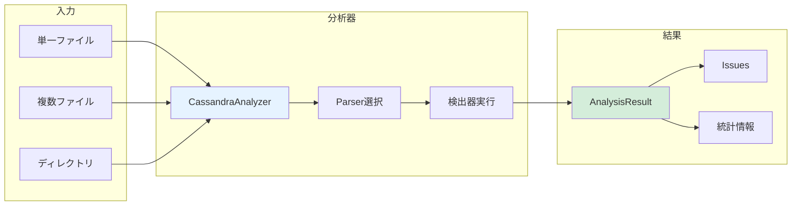
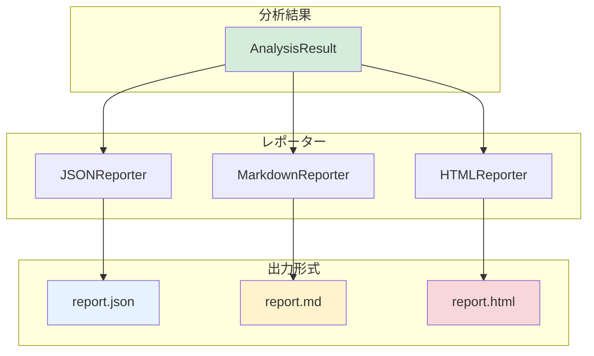
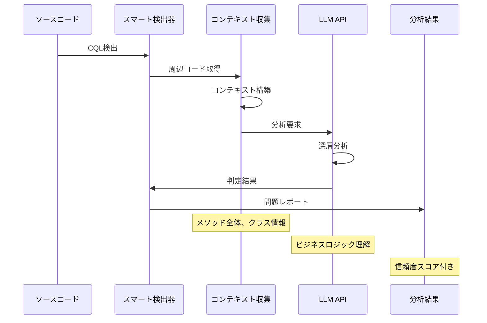

# USAGE.md - 使用方法ガイド

*バージョン: v2.0.0*
*最終更新: 2025年01月26日 20:50 JST*

Cassandra Code Analyzerの詳細な使用方法とサンプルコード集です。

## 目次

- [基本的な使い方](#基本的な使い方)
- [分析方法](#分析方法)
- [レポート生成](#レポート生成)
- [設定とカスタマイズ](#設定とカスタマイズ)
- [LLM統合](#llm統合)
- [CLIの使用](#cliの使用)
- [実践的なユースケース](#実践的なユースケース)
- [トラブルシューティング](#トラブルシューティング)

## 基本的な使い方

### Pythonスクリプトでの使用

```python
from cassandra_analyzer.analyzer import CassandraAnalyzer

# 基本的な分析
analyzer = CassandraAnalyzer()
result = analyzer.analyze_file("path/to/UserDao.java")

# 結果の表示
print(f"検出された問題: {result.total_issues}件")
print(f"Critical: {result.critical_count}件")
print(f"High: {result.high_count}件")
print(f"Medium: {result.medium_count}件")
print(f"Low: {result.low_count}件")
```

### インタラクティブシェルでの使用

```python
>>> from cassandra_analyzer.analyzer import CassandraAnalyzer
>>> from cassandra_analyzer.reporters import MarkdownReporter

>>> analyzer = CassandraAnalyzer()
>>> result = analyzer.analyze_directory("./dao")
>>>
>>> # 重要度の高い問題のみ表示
>>> critical_issues = result.get_critical_issues()
>>> for issue in critical_issues:
...     print(f"{issue.file_path}:{issue.line_number} - {issue.message}")
```

## 分析方法

### 分析処理のフロー



### 単一ファイルの分析

```python
from cassandra_analyzer.analyzer import CassandraAnalyzer

analyzer = CassandraAnalyzer()

# ファイルパスを指定して分析
result = analyzer.analyze_file("src/main/java/com/example/dao/UserDao.java")

# 結果の確認
if result.total_issues > 0:
    print(f"⚠️ {result.total_issues}個の問題が検出されました")
    for issue in result.issues:
        print(f"  - {issue.severity.upper()}: {issue.message} ({issue.file_path}:{issue.line_number})")
else:
    print("✅ 問題は検出されませんでした")
```

### ディレクトリ全体の分析

```python
from cassandra_analyzer.analyzer import CassandraAnalyzer

analyzer = CassandraAnalyzer()

# ディレクトリを再帰的に分析
result = analyzer.analyze_directory(
    directory="src/main/java/com/example/dao",
    pattern="**/*.java"  # デフォルト: 全Javaファイル
)

# ファイル別の問題を表示
issues_by_file = result.get_issues_by_file()
for file_path, issues in issues_by_file.items():
    print(f"\n📁 {file_path}")
    for issue in issues:
        print(f"  L{issue.line_number}: [{issue.severity}] {issue.message}")
```

### 複数ファイルの個別分析

```python
from cassandra_analyzer.analyzer import CassandraAnalyzer

analyzer = CassandraAnalyzer()

# 特定のファイルリストを分析
files_to_analyze = [
    "dao/UserDao.java",
    "dao/OrderDao.java",
    "dao/ProductDao.java",
]

result = analyzer.analyze_files(files_to_analyze)

print(f"分析ファイル数: {result.total_files}")
print(f"検出問題数: {result.total_issues}")
```

## レポート生成

### レポート生成のワークフロー



### JSON形式のレポート

```python
from cassandra_analyzer.analyzer import CassandraAnalyzer
from cassandra_analyzer.reporters import JSONReporter

# 分析実行
analyzer = CassandraAnalyzer()
result = analyzer.analyze_directory("./dao")

# JSONレポート生成
json_reporter = JSONReporter()
report = json_reporter.generate(result)

# ファイルに保存
json_reporter.save(report, "reports/analysis_report.json")

# または一括で生成・保存
json_reporter.generate_and_save(result, "reports/analysis_report.json")

print("✅ JSONレポートを生成しました: reports/analysis_report.json")
```

#### JSONレポートのカスタマイズ

```python
from cassandra_analyzer.reporters import JSONReporter

# カスタム設定でレポーター作成
json_reporter = JSONReporter(config={
    "indent": 4,            # インデントを4スペースに
    "ensure_ascii": False,  # 日本語をそのまま出力
    "include_stats": True,  # 統計情報を含める
    "pretty_print": True    # 読みやすい形式
})

report = json_reporter.generate(result)
json_reporter.save(report, "reports/custom_report.json")
```

### Markdown形式のレポート

```python
from cassandra_analyzer.analyzer import CassandraAnalyzer
from cassandra_analyzer.reporters import MarkdownReporter

analyzer = CassandraAnalyzer()
result = analyzer.analyze_directory("./dao")

# Markdownレポート生成
md_reporter = MarkdownReporter()
md_reporter.generate_and_save(result, "reports/analysis_report.md")

print("✅ Markdownレポートを生成しました: reports/analysis_report.md")
```

#### Markdownレポートのグループ化オプション

```python
from cassandra_analyzer.reporters import MarkdownReporter

# ファイル別にグループ化（デフォルト）
md_reporter_by_file = MarkdownReporter(config={
    "group_by_file": True,
    "include_toc": True,  # 目次を含める
    "include_recommendations": True  # 推奨事項を含める
})
md_reporter_by_file.generate_and_save(result, "reports/by_file.md")

# 重要度別にグループ化
md_reporter_by_severity = MarkdownReporter(config={
    "group_by_file": False,
    "group_by_severity": True,
    "include_code_snippets": True  # コードスニペットを含める
})
md_reporter_by_severity.generate_and_save(result, "reports/by_severity.md")
```

### HTML形式のレポート

```python
from cassandra_analyzer.analyzer import CassandraAnalyzer
from cassandra_analyzer.reporters import HTMLReporter

analyzer = CassandraAnalyzer()
result = analyzer.analyze_directory("./dao")

# HTMLレポート生成
html_reporter = HTMLReporter()
html_reporter.generate_and_save(result, "reports/analysis_report.html")

print("✅ HTMLレポートを生成しました: reports/analysis_report.html")
print("   ブラウザで開いて確認してください")
```

#### HTMLレポートのカスタマイズ

```python
from cassandra_analyzer.reporters import HTMLReporter

# カスタムタイトルとテーマでレポート生成
html_reporter = HTMLReporter(config={
    "title": "Production Code Analysis - 2025-01-26",
    "theme": "dark",  # light/dark
    "include_charts": True,  # グラフを含める
    "interactive": True,  # インタラクティブ要素を有効化
    "filtering": True  # フィルタリング機能を有効化
})
html_reporter.generate_and_save(result, "reports/production_analysis.html")
```

### 全形式のレポートを一括生成

```python
from cassandra_analyzer.analyzer import CassandraAnalyzer
from cassandra_analyzer.reporters import JSONReporter, MarkdownReporter, HTMLReporter

# 分析実行
analyzer = CassandraAnalyzer()
result = analyzer.analyze_directory("./dao")

# 3形式全てのレポートを生成
reporters = {
    "json": JSONReporter(),
    "markdown": MarkdownReporter(),
    "html": HTMLReporter(),
}

for format_name, reporter in reporters.items():
    output_file = f"reports/analysis_report.{reporter.file_extension.lstrip('.')}"
    reporter.generate_and_save(result, output_file)
    print(f"✅ {reporter.format_name}レポートを生成: {output_file}")
```

## 設定とカスタマイズ

### 設定ファイルの構造

```yaml
# config.yaml
# 分析設定
analysis:
  # パーサー設定
  parser:
    type: "regex"  # regex | ast
    encoding: "utf-8"

  # 検出器設定
  detectors:
    # 有効にする検出器
    enabled:
      - allow_filtering
      - partition_key
      - batch_size
      - prepared_statement
      - smart_allow_filtering  # LLM統合時
      - smart_partition_key     # LLM統合時

    # 検出器別の設定
    configs:
      batch_size:
        threshold: 50  # バッチサイズの閾値

      partition_key:
        strict_mode: true  # 厳格モード

      allow_filtering:
        ignore_patterns:  # 無視するパターン
          - ".*COUNT.*"

# レポート設定
reporters:
  json:
    indent: 2
    ensure_ascii: false

  markdown:
    group_by_file: true
    include_recommendations: true

  html:
    title: "Cassandra Analysis Report"
    theme: "dark"

# LLM設定（オプション）
llm:
  enabled: false
  provider: anthropic
  api_key: ${ANTHROPIC_API_KEY}
  model: claude-3-haiku-20240307
```

### 検出器の選択的有効化

```python
from cassandra_analyzer.analyzer import CassandraAnalyzer

# ALLOW FILTERINGとPartition Key問題のみ検出
config = {
    "detectors": ["allow_filtering", "partition_key"]
}

analyzer = CassandraAnalyzer(config=config)
result = analyzer.analyze_directory("./dao")
```

### 検出器パラメータのカスタマイズ

```python
from cassandra_analyzer.analyzer import CassandraAnalyzer

# Batch Sizeの閾値を変更
config = {
    "detector_configs": {
        "batch_size": {
            "threshold": 50  # デフォルトは100
        }
    }
}

analyzer = CassandraAnalyzer(config=config)
result = analyzer.analyze_file("dao/OrderDao.java")
```

### 複合設定例

```python
from cassandra_analyzer.analyzer import CassandraAnalyzer

# 詳細な設定
config = {
    # 有効な検出器を指定
    "detectors": [
        "allow_filtering",
        "partition_key",
        "batch_size"
    ],

    # 検出器別の設定
    "detector_configs": {
        "batch_size": {
            "threshold": 50
        },
        "partition_key": {
            "strict_mode": True,
            "check_clustering_keys": True
        }
    },

    # パーサー設定
    "parser": {
        "type": "ast",  # ASTパーサーを使用
        "timeout": 30    # タイムアウト秒数
    }
}

analyzer = CassandraAnalyzer(config=config)
result = analyzer.analyze_directory("./dao")

print(f"有効な検出器数: {len(analyzer.detectors)}")
```

## LLM統合

### LLM統合の仕組み



### LLM統合の設定

```python
from cassandra_analyzer.analyzer import CassandraAnalyzer

# LLM統合を有効化
config = {
    "llm": {
        "enabled": True,
        "provider": "anthropic",
        "api_key": "your-api-key-here",
        "model": "claude-3-haiku-20240307",

        # 詳細設定
        "prompts": {
            "temperature": 0.3,
            "max_tokens": 1000,
            "system_prompt": "You are an expert in Cassandra query optimization."
        },

        # キャッシュ設定
        "cache": {
            "enabled": True,
            "ttl": 3600,
            "max_size": 1000
        }
    },

    # スマート検出器を有効化
    "detectors": [
        "allow_filtering",
        "partition_key",
        "smart_allow_filtering",  # LLM使用
        "smart_partition_key"      # LLM使用
    ]
}

analyzer = CassandraAnalyzer(config=config)
result = analyzer.analyze_directory("./dao")
```

### LLM分析結果の活用

```python
# スマート検出器の結果を確認
for issue in result.issues:
    if issue.detector_name.startswith("Smart"):
        print(f"\n🤖 LLM検出: {issue.message}")
        print(f"   信頼度: {issue.confidence * 100:.0f}%")
        print(f"   根拠: {issue.evidence}")
        print(f"   推奨: {issue.recommendation}")
```

## CLIの使用

### 基本コマンド

```bash
# ヘルプ表示
cassandra-analyzer --help

# バージョン表示
cassandra-analyzer --version

# 単一ファイルの分析
cassandra-analyzer analyze path/to/UserDao.java

# ディレクトリの分析
cassandra-analyzer analyze path/to/dao/

# 出力フォーマット指定
cassandra-analyzer analyze path/to/dao/ --format json --output report.json
cassandra-analyzer analyze path/to/dao/ --format markdown --output report.md
cassandra-analyzer analyze path/to/dao/ --format html --output report.html
```

### 高度なオプション

```bash
# 特定の検出器のみ有効化
cassandra-analyzer analyze path/to/dao/ \
  --detectors allow_filtering,partition_key \
  --output report.json

# LLM統合を有効化
cassandra-analyzer analyze path/to/dao/ \
  --enable-llm \
  --api-key $ANTHROPIC_API_KEY \
  --llm-model claude-3-haiku-20240307 \
  --output smart_report.html

# 設定ファイルを使用
cassandra-analyzer analyze path/to/dao/ \
  --config config.yaml \
  --output analysis.json

# 詳細ログ出力
cassandra-analyzer analyze path/to/dao/ \
  --verbose \
  --log-level DEBUG \
  --output report.md

# 並列処理の設定
cassandra-analyzer analyze path/to/dao/ \
  --workers 4 \
  --timeout 60 \
  --output report.html
```

### バッチ処理スクリプト

```bash
#!/bin/bash
# batch_analysis.sh

# 複数プロジェクトの一括分析
PROJECTS=("project1" "project2" "project3")
DATE=$(date +%Y%m%d)

for project in "${PROJECTS[@]}"; do
    echo "Analyzing $project..."

    cassandra-analyzer analyze \
        "projects/$project/src/main/java" \
        --config config.yaml \
        --format html \
        --output "reports/${project}_${DATE}.html" \
        --verbose

    echo "✅ Completed: $project"
done

echo "All analyses completed!"
```

## 実践的なユースケース

### ユースケース1: CI/CDパイプラインへの統合

```python
#!/usr/bin/env python3
"""
CI/CD用分析スクリプト
"""
import sys
from pathlib import Path
from cassandra_analyzer.analyzer import CassandraAnalyzer
from cassandra_analyzer.reporters import JSONReporter

def main():
    # プロジェクトのDAOディレクトリを分析
    analyzer = CassandraAnalyzer()
    result = analyzer.analyze_directory("src/main/java/com/example/dao")

    # JSONレポート生成
    json_reporter = JSONReporter()
    json_reporter.generate_and_save(result, "reports/ci_analysis.json")

    # Critical問題があればビルド失敗
    if result.critical_count > 0:
        print(f"❌ Critical問題が{result.critical_count}件検出されました")
        for issue in result.get_critical_issues():
            print(f"  {issue.file_path}:{issue.line_number} - {issue.message}")
        sys.exit(1)

    # High問題があれば警告
    if result.high_count > 0:
        print(f"⚠️ High問題が{result.high_count}件検出されました")
        # 警告として扱い、ビルドは継続

    print(f"✅ 分析完了: {result.total_files}ファイル, {result.total_issues}問題")
    sys.exit(0)

if __name__ == "__main__":
    main()
```

#### GitHub Actions統合例

```yaml
# .github/workflows/cassandra-analysis.yml
name: Cassandra Code Analysis

on: [push, pull_request]

jobs:
  analyze:
    runs-on: ubuntu-latest

    steps:
    - uses: actions/checkout@v2

    - name: Set up Python
      uses: actions/setup-python@v2
      with:
        python-version: '3.9'

    - name: Install dependencies
      run: |
        pip install cassandra-analyzer

    - name: Run Cassandra Analysis
      run: |
        cassandra-analyzer analyze src/main/java \
          --format json \
          --output analysis.json

    - name: Upload results
      uses: actions/upload-artifact@v2
      with:
        name: cassandra-analysis
        path: analysis.json
```

### ユースケース2: コードレビュー支援

```python
#!/usr/bin/env python3
"""
Pull Request用分析スクリプト
"""
from cassandra_analyzer.analyzer import CassandraAnalyzer
from cassandra_analyzer.reporters import MarkdownReporter
import subprocess

def get_changed_files():
    """Gitで変更されたファイルを取得"""
    result = subprocess.run(
        ["git", "diff", "--name-only", "origin/main...HEAD"],
        capture_output=True,
        text=True
    )
    return result.stdout.strip().split('\n')

def analyze_pr_changes():
    """変更されたファイルのみを分析"""
    changed_files = get_changed_files()

    # Javaファイルのみフィルタ
    java_files = [f for f in changed_files if f.endswith('.java')]

    if not java_files:
        print("✅ Java DAOファイルの変更なし")
        return

    # 変更されたファイルを分析
    analyzer = CassandraAnalyzer()
    result = analyzer.analyze_files(java_files)

    # Markdownレポート生成（PRコメント用）
    md_reporter = MarkdownReporter(config={
        "include_file_links": True,
        "compact_mode": True
    })
    report = md_reporter.generate(result)

    # レポートをファイルに保存
    with open("pr_analysis.md", "w", encoding="utf-8") as f:
        f.write(report)

    print(f"📝 PR分析レポートを生成しました: pr_analysis.md")
    print(f"   {result.total_issues}個の問題を検出")

    # GitHub PRコメントとして投稿（GitHub CLIを使用）
    if result.total_issues > 0:
        subprocess.run([
            "gh", "pr", "comment", "--body-file", "pr_analysis.md"
        ])

if __name__ == "__main__":
    analyze_pr_changes()
```

### ユースケース3: 定期的なコード品質チェック

```python
#!/usr/bin/env python3
"""
週次品質レポート生成スクリプト
"""
from datetime import datetime
from cassandra_analyzer.analyzer import CassandraAnalyzer
from cassandra_analyzer.reporters import HTMLReporter, JSONReporter
import json
from pathlib import Path

def generate_weekly_report():
    """週次レポートを生成"""
    # タイムスタンプ
    timestamp = datetime.now().strftime("%Y-%m-%d")

    # 全DAOファイルを分析
    analyzer = CassandraAnalyzer()
    result = analyzer.analyze_directory("src/main/java/com/example/dao")

    # HTMLレポート（閲覧用）
    html_reporter = HTMLReporter(config={
        "title": f"Weekly Code Quality Report - {timestamp}",
        "include_trends": True  # トレンドグラフを含める
    })
    html_reporter.generate_and_save(
        result,
        f"reports/weekly/report_{timestamp}.html"
    )

    # JSONレポート（トレンド分析用）
    json_reporter = JSONReporter()
    json_reporter.generate_and_save(
        result,
        f"reports/weekly/report_{timestamp}.json"
    )

    # トレンド分析
    analyze_trends(result, timestamp)

    # サマリーを出力
    print(f"📊 週次レポート生成完了 ({timestamp})")
    print(f"  分析ファイル数: {result.total_files}")
    print(f"  検出問題数: {result.total_issues}")
    print(f"    🔴 Critical: {result.critical_count}")
    print(f"    🟠 High: {result.high_count}")
    print(f"    🟡 Medium: {result.medium_count}")
    print(f"    🔵 Low: {result.low_count}")
    print(f"  分析時間: {result.analysis_time:.2f}秒")

def analyze_trends(current_result, timestamp):
    """前回との比較分析"""
    trends_file = Path("reports/weekly/trends.json")

    # 既存のトレンドデータを読み込み
    if trends_file.exists():
        with open(trends_file, "r") as f:
            trends = json.load(f)
    else:
        trends = {"history": []}

    # 現在の結果を追加
    trends["history"].append({
        "date": timestamp,
        "total_issues": current_result.total_issues,
        "critical": current_result.critical_count,
        "high": current_result.high_count,
        "medium": current_result.medium_count,
        "low": current_result.low_count
    })

    # トレンドデータを保存
    with open(trends_file, "w") as f:
        json.dump(trends, f, indent=2)

    # 前回との比較
    if len(trends["history"]) >= 2:
        prev = trends["history"][-2]
        curr = trends["history"][-1]

        diff = curr["total_issues"] - prev["total_issues"]
        if diff > 0:
            print(f"  ⚠️ 問題が{diff}件増加しました")
        elif diff < 0:
            print(f"  ✅ 問題が{abs(diff)}件減少しました")
        else:
            print(f"  → 問題数は変化なし")

if __name__ == "__main__":
    generate_weekly_report()
```

### ユースケース4: 問題のフィルタリングと詳細表示

```python
from cassandra_analyzer.analyzer import CassandraAnalyzer

# 分析実行
analyzer = CassandraAnalyzer()
result = analyzer.analyze_directory("./dao")

# ALLOW FILTERING問題のみ抽出
allow_filtering_issues = [
    issue for issue in result.issues
    if issue.issue_type == "ALLOW_FILTERING"
]

print(f"ALLOW FILTERING問題: {len(allow_filtering_issues)}件")
for issue in allow_filtering_issues:
    print(f"\n📍 {issue.file_path}:{issue.line_number}")
    print(f"   CQL: {issue.cql_text}")
    print(f"   推奨: {issue.recommendation}")
    print(f"   信頼度: {issue.confidence * 100:.0f}%")
```

### ユースケース5: カスタムレポート生成

```python
from cassandra_analyzer.analyzer import CassandraAnalyzer
import json

# 分析実行
analyzer = CassandraAnalyzer()
result = analyzer.analyze_directory("./dao")

# カスタムフォーマットでデータを処理
custom_report = {
    "scan_date": result.timestamp,
    "summary": {
        "files": result.total_files,
        "issues": result.total_issues,
        "critical_files": len([
            f for f, issues in result.get_issues_by_file().items()
            if any(i.severity == "critical" for i in issues)
        ])
    },
    "top_issues": [
        {
            "file": issue.file_path,
            "line": issue.line_number,
            "type": issue.issue_type,
            "severity": issue.severity,
        }
        for issue in sorted(
            result.issues,
            key=lambda x: {"critical": 0, "high": 1, "medium": 2, "low": 3}[x.severity]
        )[:10]  # Top 10問題
    ],
    "metrics": {
        "avg_issues_per_file": result.total_issues / max(result.total_files, 1),
        "critical_rate": result.critical_count / max(result.total_issues, 1) * 100,
        "detection_time_ms": result.analysis_time * 1000
    }
}

# Slackやチャットツールに送信するためのフォーマット
print(json.dumps(custom_report, indent=2, ensure_ascii=False))
```

## トラブルシューティング

### 問題: ファイルが見つからない

```python
from cassandra_analyzer.analyzer import CassandraAnalyzer
from pathlib import Path

file_path = "path/to/file.java"

# ファイルの存在確認
if not Path(file_path).exists():
    print(f"❌ ファイルが見つかりません: {file_path}")
    # ファイルパスのデバッグ
    print(f"   現在のディレクトリ: {Path.cwd()}")
    print(f"   絶対パス: {Path(file_path).absolute()}")
    exit(1)

analyzer = CassandraAnalyzer()
result = analyzer.analyze_file(file_path)
```

### 問題: 問題が検出されない

```python
from cassandra_analyzer.analyzer import CassandraAnalyzer

analyzer = CassandraAnalyzer()
result = analyzer.analyze_file("dao/UserDao.java")

if result.total_issues == 0:
    print("✅ 問題は検出されませんでした")
    print(f"   分析ファイル数: {result.total_files}")
    print(f"   Cassandra呼び出し数: {result.total_calls}")
    print(f"   有効な検出器: {len(analyzer.detectors)}")
    print(f"   検出器リスト: {[d.__class__.__name__ for d in analyzer.detectors]}")

    # デバッグ情報
    if result.total_calls == 0:
        print("   ⚠️ Cassandra呼び出しが見つかりませんでした")
        print("      ファイルがDAOクラスであることを確認してください")
else:
    print(f"⚠️ {result.total_issues}個の問題を検出")
```

### 問題: 特定の検出器が動作しない

```python
from cassandra_analyzer.analyzer import CassandraAnalyzer

# デバッグ用設定
config = {
    "detectors": ["allow_filtering"],  # 1つずつテスト
    "verbose": True  # 詳細ログ
}

analyzer = CassandraAnalyzer(config=config)
result = analyzer.analyze_file("dao/UserDao.java")

print(f"検出器数: {len(analyzer.detectors)}")
print(f"検出問題数: {result.total_issues}")

# 各検出器の詳細
for detector in analyzer.detectors:
    print(f"  - {detector.__class__.__name__}: 有効={detector.is_enabled()}")
    if hasattr(detector, 'config'):
        print(f"    設定: {detector.config}")
```

### 問題: パフォーマンスが遅い

```python
from cassandra_analyzer.analyzer import CassandraAnalyzer
import time

# パフォーマンス測定
start = time.time()

# 基本検出器のみで高速化
config = {
    "detectors": ["allow_filtering", "partition_key"],  # 最重要のみ
    "llm": {"enabled": False}  # LLMを無効化
}

analyzer = CassandraAnalyzer(config=config)
result = analyzer.analyze_directory("./large_project")

elapsed = time.time() - start

print(f"分析時間: {elapsed:.2f}秒")
print(f"ファイル数: {result.total_files}")
print(f"平均: {elapsed / result.total_files:.3f}秒/ファイル")

# ボトルネックの特定
if elapsed > 30:
    print("\n⚠️ パフォーマンス改善の提案:")
    print("  1. 検出器を減らす")
    print("  2. LLM統合を無効化")
    print("  3. 並列処理を有効化")
    print("  4. キャッシュを有効化")
```

### 問題: レポートの文字化け

```python
from cassandra_analyzer.reporters import JSONReporter

# UTF-8エンコーディングを明示
json_reporter = JSONReporter(config={
    "ensure_ascii": False  # 日本語をそのまま出力
})

report = json_reporter.generate(result)

# ファイル保存時もUTF-8を指定
with open("report.json", "w", encoding="utf-8") as f:
    f.write(report)

# BOM付きUTF-8で保存（Excelなど向け）
with open("report_with_bom.json", "w", encoding="utf-8-sig") as f:
    f.write(report)
```

### 問題: LLM APIエラー

```python
from cassandra_analyzer.analyzer import CassandraAnalyzer
import os

# APIキーの確認
api_key = os.environ.get("ANTHROPIC_API_KEY")
if not api_key:
    print("❌ APIキーが設定されていません")
    print("   環境変数 ANTHROPIC_API_KEY を設定してください")
    exit(1)

# タイムアウトとリトライの設定
config = {
    "llm": {
        "enabled": True,
        "api_key": api_key,
        "timeout": 30,  # タイムアウト秒数
        "retry_count": 3,  # リトライ回数
        "retry_delay": 1  # リトライ間隔（秒）
    }
}

try:
    analyzer = CassandraAnalyzer(config=config)
    result = analyzer.analyze_file("dao/UserDao.java")
except Exception as e:
    print(f"❌ LLM APIエラー: {e}")
    print("   フォールバック: 基本検出器のみで再実行")

    # LLMを無効化して再実行
    config["llm"]["enabled"] = False
    analyzer = CassandraAnalyzer(config=config)
    result = analyzer.analyze_file("dao/UserDao.java")
```

## ベストプラクティス

### 1. 段階的な導入

```python
# Step 1: 基本分析から開始
analyzer = CassandraAnalyzer(config={
    "detectors": ["allow_filtering"]  # 最も重要な1つから
})

# Step 2: 検出器を追加
analyzer = CassandraAnalyzer(config={
    "detectors": ["allow_filtering", "partition_key"]
})

# Step 3: LLM統合を追加（精度向上）
analyzer = CassandraAnalyzer(config={
    "detectors": ["allow_filtering", "partition_key", "smart_allow_filtering"],
    "llm": {"enabled": True}
})
```

### 2. CI/CDでの段階的適用

```python
# 最初は警告のみ
if result.critical_count > 0:
    print(f"⚠️ Critical問題が検出されました（警告のみ）")
    # sys.exit(0)  # 最初はビルドを失敗させない

# 慣れてきたらエラーに
if result.critical_count > 0:
    sys.exit(1)  # ビルドを失敗させる
```

### 3. カスタムルールの定義

```python
# プロジェクト固有のルールを設定
config = {
    "detector_configs": {
        "batch_size": {
            "threshold": 30  # プロジェクトに合わせた閾値
        },
        "allow_filtering": {
            "ignore_patterns": [
                ".*COUNT\\(\\*\\).*",  # COUNT(*)は許可
                ".*LIMIT 1.*"  # LIMIT 1は許可
            ]
        }
    }
}
```

## ヘルプとサポート

詳細な情報は以下を参照してください：

- [README.md](README.md) - プロジェクト概要
- [DEVELOPMENT.md](DEVELOPMENT.md) - 開発者向けガイド
- [API Documentation](docs/api/) - APIリファレンス
- [Issue Tracker](https://github.com/your-org/cassandra-analyzer/issues) - バグ報告・質問

---

*最終更新: 2025年01月26日 20:50 JST*
*バージョン: v2.0.0*

**更新履歴:**
- v2.0.0 (2025年01月26日): mermaid図追加、LLM統合の詳細化、CLI使用方法の追加