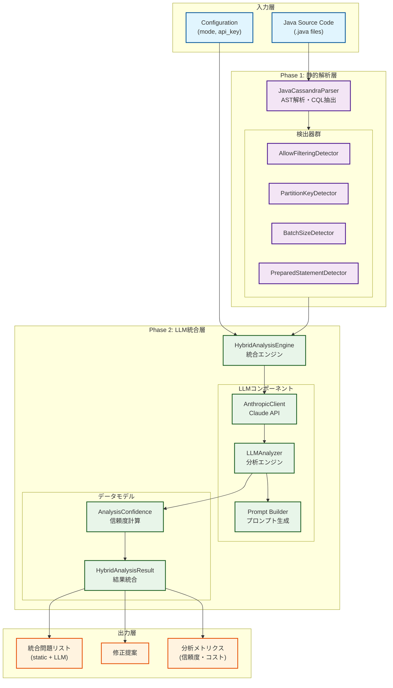
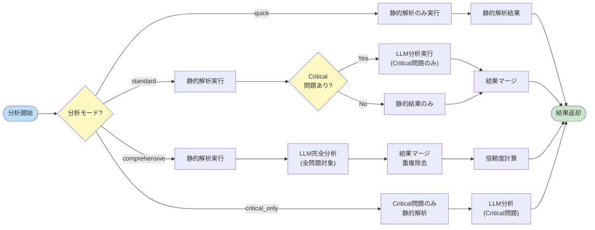
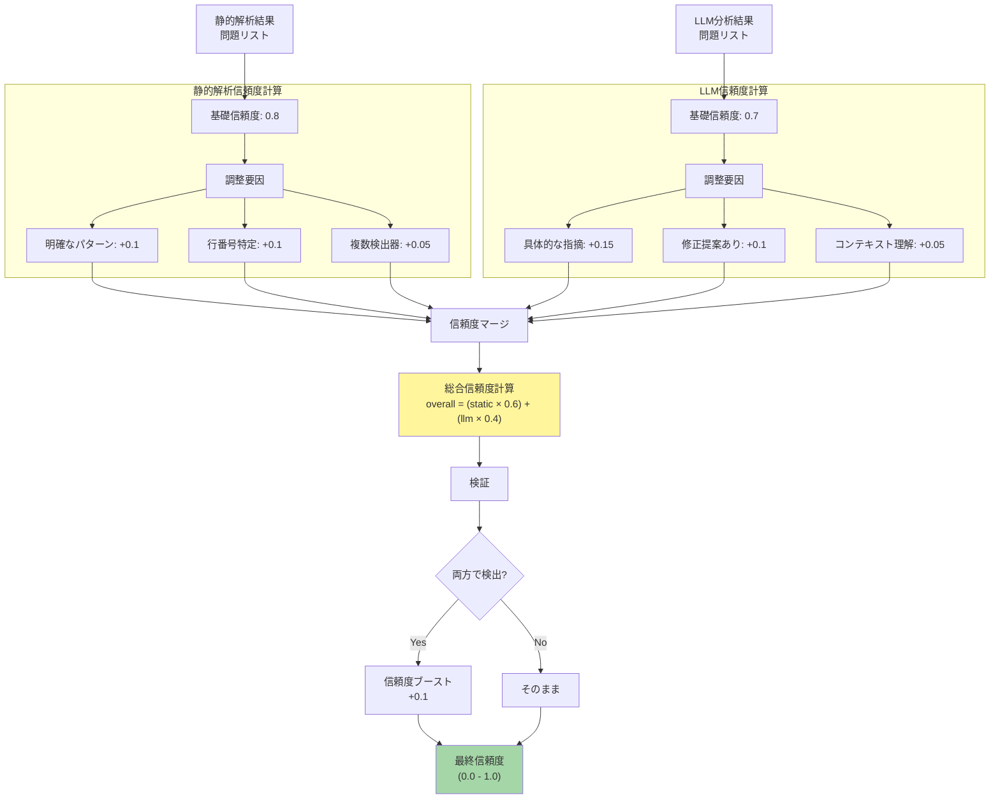
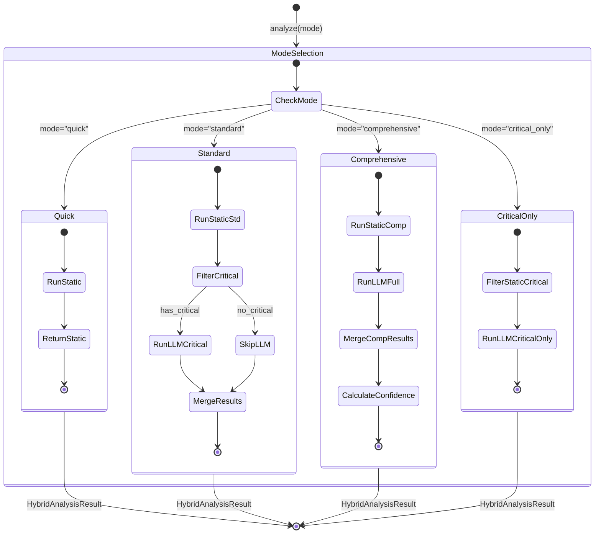
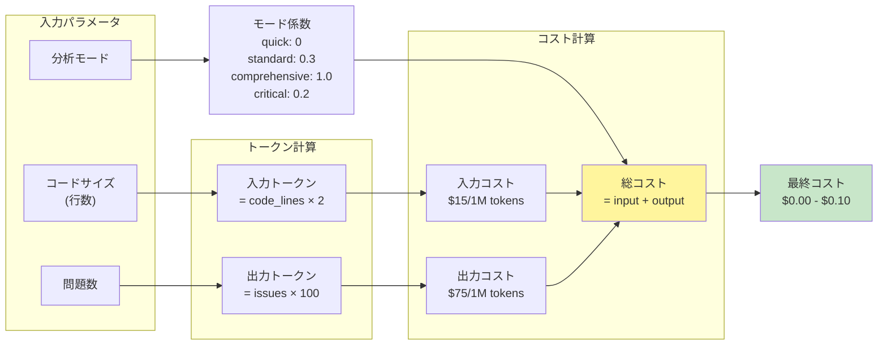
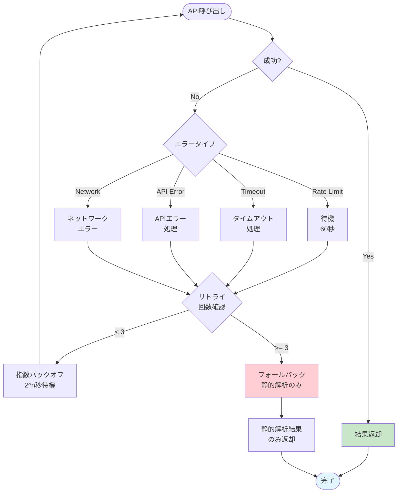
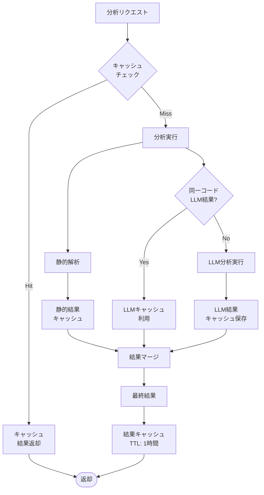
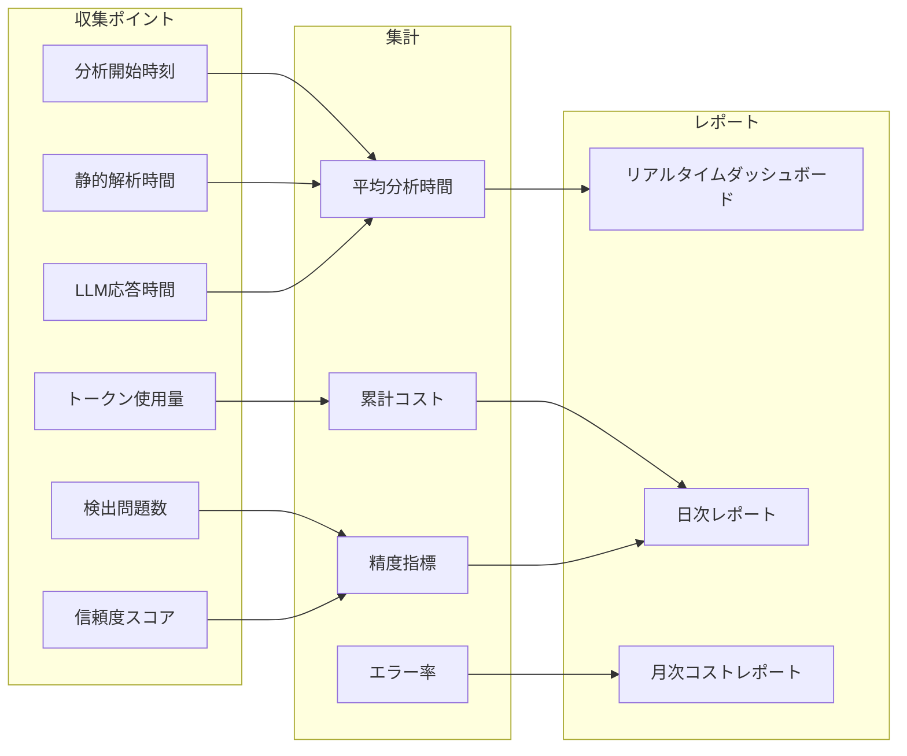

# Phase 2: LLM統合アーキテクチャ

*バージョン: v1.0.0*
*最終更新: 2025年01月27日 15:40 JST*

## 📐 システムアーキテクチャ概要

Phase 2では、Phase 1の静的解析システムにLLM（Large Language Model）分析機能を統合し、より高度な問題検出と修正提案を実現しています。

## 🏗️ Phase 2 システムアーキテクチャ図

## 🔄 ハイブリッド分析フロー図

## 📊 信頼度計算フロー図

## 🗂️ データモデル関係図

## 🔀 分析モード決定フロー

## 📈 コスト計算モデル

## 🔐 エラーハンドリングフロー

## 🚀 パフォーマンス最適化

### キャッシング戦略

## 📊 メトリクス収集

## 🔗 Phase 1との統合ポイント

1. **検出器の再利用**
   - AllowFilteringDetector
   - PartitionKeyDetector
   - BatchSizeDetector
   - PreparedStatementDetector

2. **モデルの拡張**
   - Issue → HybridIssue（信頼度追加）
   - AnalysisResult → HybridAnalysisResult

3. **パーサーの共有**
   - JavaCassandraParser
   - ASTParser
   - CQLExtractor

4. **レポート生成の強化**
   - HTML/JSON/Markdownフォーマット維持
   - LLM分析結果の統合表示
   - 信頼度スコアの可視化

## 📝 設計原則

1. **モジュラー設計**
   - 各コンポーネントは独立して動作可能
   - インターフェース経由での疎結合

2. **フェイルセーフ**
   - LLM失敗時は静的解析結果を返却
   - 部分的な失敗を許容

3. **コスト効率**
   - モード選択による最適化
   - キャッシング活用

4. **拡張性**
   - 新しいLLMプロバイダーの追加容易
   - 新しい分析モードの追加可能

---

*最終更新: 2025年01月27日 15:40 JST*
*バージョン: v1.0.0*

**更新履歴:**
- v1.0.0 (2025年01月27日): Phase 2アーキテクチャ図初版作成、全図表完成