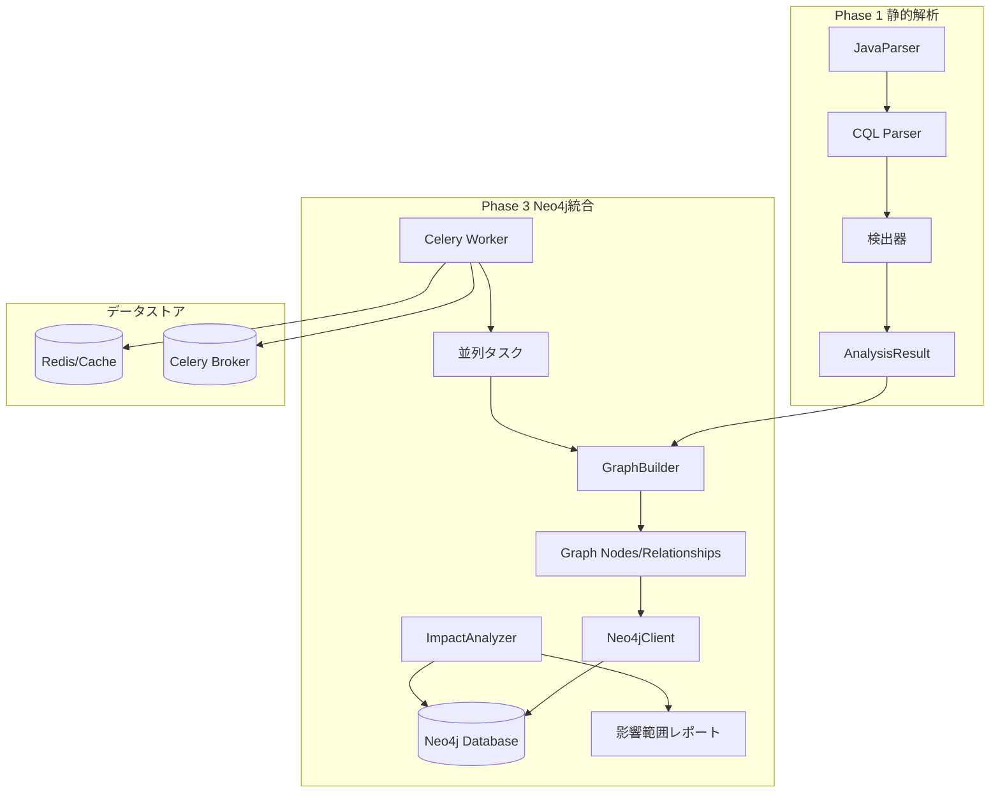
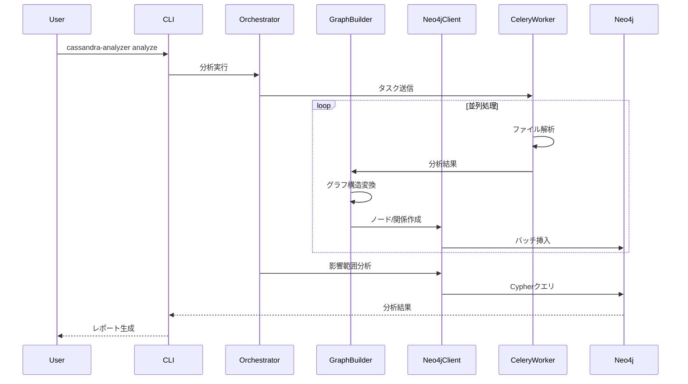
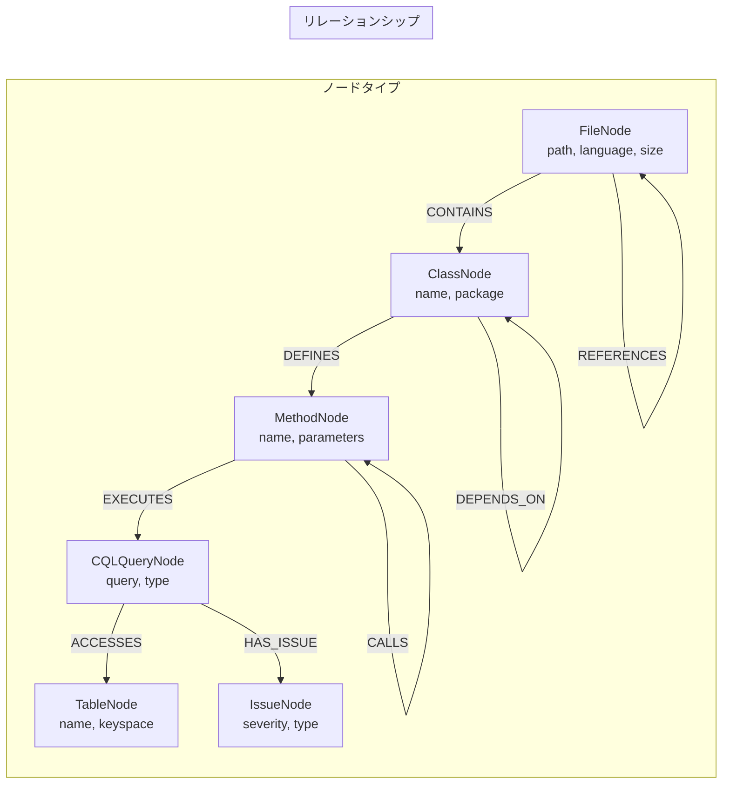
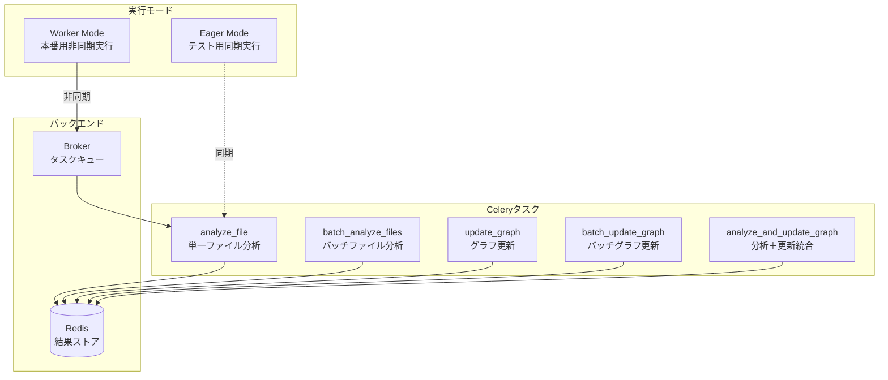

# Phase 3: Neo4Jグラフデータベース統合

*バージョン: v3.0.0*
*最終更新: 2025年01月27日 18:30 JST*

**ステータス**: ✅ 完了
**完了日**: 2025年01月27日 JST
**テストカバレッジ**: 83% (+17%向上)
**統合テスト**: 43件全通過

## 📊 プロジェクト概要

Phase 3では、Neo4jグラフデータベースとCelery並列処理を統合し、コード構造の可視化と影響範囲分析を実現しました。Phase 1の静的解析結果をグラフ構造に変換し、複雑な依存関係を効率的に管理・分析できる基盤を構築しました。

## 🎯 主要成果

- **GraphBuilder実装** - 分析結果のグラフ変換（100%カバレッジ）
- **Neo4jClient実装** - データベース操作（98%カバレッジ）
- **Celeryタスク実装** - 並列処理（97%カバレッジ）
- **統合テスト43件** - 全通過
- **テストカバレッジ向上** - 66% → 83% (+17%)

## 🏗️ アーキテクチャ

### システム全体図



### データフロー図



### グラフデータベーススキーマ



### Celery並列処理アーキテクチャ



## 📁 ディレクトリ構造

```
phase3_neo4j/
├── src/graph_analyzer/
│   ├── graph/
│   │   ├── __init__.py
│   │   ├── neo4j_client.py      # Neo4j接続・操作 (98%カバレッジ)
│   │   ├── graph_builder.py     # グラフ構築 (100%カバレッジ)
│   │   └── models.py            # Pydanticモデル定義
│   ├── impact/
│   │   └── impact_analyzer.py   # 影響範囲分析
│   └── tasks/
│       ├── __init__.py
│       ├── celery_app.py        # Celery設定
│       └── tasks.py             # 並列処理タスク (97%カバレッジ)
├── tests/
│   ├── unit/
│   │   ├── test_neo4j_client.py     # 30+ テスト
│   │   ├── test_graph_builder.py    # 25+ テスト
│   │   └── test_impact_analyzer.py  # 25+ テスト
│   └── integration/
│       └── test_celery_integration.py # 43 統合テスト
├── scripts/
│   ├── setup_neo4j.sh          # Neo4jセットアップ
│   └── run_tests.sh            # テスト実行スクリプト
├── docker-compose.yml           # Docker環境定義
├── docker-compose.test.yml     # テスト環境定義
├── requirements.txt             # 本番依存関係
├── requirements-dev.txt        # 開発依存関係
└── README.md                    # このファイル
```

## 🚀 セットアップ

### 前提条件

- Python 3.11以上
- Neo4j 5.14以上
- Redis 5.0以上（Celery用）
- Docker & Docker Compose（推奨）

### インストール手順

```bash
# 1. 仮想環境の作成と有効化
python -m venv venv
source venv/bin/activate  # Windows: venv\Scripts\activate

# 2. 依存パッケージのインストール
pip install -r requirements.txt
pip install -r requirements-dev.txt

# 3. 開発モードでパッケージをインストール
pip install -e .

# 4. 環境変数の設定
cp .env.example .env
# .envファイルを編集してNeo4j接続情報を設定
```

### Docker環境のセットアップ

```bash
# 開発環境の起動
docker-compose up -d

# テスト環境の起動
docker-compose -f docker-compose.test.yml up -d

# ログ確認
docker-compose logs -f neo4j
docker-compose logs -f redis
```

### 環境変数設定

```bash
# .env ファイル
NEO4J_URI=bolt://localhost:7687
NEO4J_USER=neo4j
NEO4J_PASSWORD=password
NEO4J_DATABASE=neo4j

# Celery設定
CELERY_BROKER_URL=redis://localhost:6379/0
CELERY_RESULT_BACKEND=redis://localhost:6379/0
CELERY_TASK_ALWAYS_EAGER=False  # テスト時はTrue

# Phase 2統合（オプション）
ANTHROPIC_API_KEY=your_api_key_here
```

## 💻 使用方法

### 基本的な分析実行

```python
from graph_analyzer.graph import GraphBuilder, Neo4jClient
from graph_analyzer.impact import ImpactAnalyzer

# 1. Neo4j接続
client = Neo4jClient("bolt://localhost:7687", "neo4j", "password")

# 2. Phase 1分析結果をグラフに変換
builder = GraphBuilder()
nodes, relationships = builder.build_from_analysis(analysis_result)

# 3. Neo4jにデータ投入
with client:
    # バッチインポート（高速）
    client.batch_create_nodes(nodes, batch_size=1000)
    client.batch_create_relationships(relationships, batch_size=1000)

# 4. 影響範囲分析
analyzer = ImpactAnalyzer(client)
impact = analyzer.analyze_table_impact("users")
print(f"テーブル'users'の変更は{len(impact['affected_files'])}ファイルに影響")
```

### Celeryタスクの実行

```python
from graph_analyzer.tasks import (
    analyze_file,
    batch_analyze_files,
    update_graph,
    analyze_and_update_graph
)

# 単一ファイル分析
result = analyze_file.delay("/path/to/UserDAO.java")

# バッチ処理（並列実行）
file_paths = ["/path/to/file1.java", "/path/to/file2.java"]
results = batch_analyze_files.delay(file_paths)

# 分析と更新を統合実行
job = analyze_and_update_graph.delay("/path/to/project")
```

### 影響範囲分析の実行

```python
analyzer = ImpactAnalyzer(client)

# テーブル変更の影響分析
table_impact = analyzer.analyze_table_impact("users")
print(f"影響を受けるファイル: {table_impact['affected_files']}")
print(f"リスクレベル: {table_impact['risk_level']}")

# ファイル変更の影響分析
file_impact = analyzer.analyze_file_impact("/src/UserDAO.java", max_depth=3)
print(f"依存ファイル数: {len(file_impact['dependencies'])}")

# 高リスクファイルの検出
risky_files = analyzer.find_risky_files(min_issues=3)
for file in risky_files:
    print(f"{file['path']}: {file['issue_count']}件の問題")
```

## 🧪 テスト実行

### 全テストの実行

```bash
# ユニットテストと統合テストを実行
pytest tests/ -v

# カバレッジレポート生成
pytest tests/ --cov=src/graph_analyzer --cov-report=html

# 特定のテストモジュールのみ実行
pytest tests/unit/test_neo4j_client.py -v
pytest tests/integration/test_celery_integration.py -v
```

### テストカバレッジ詳細

| モジュール | カバレッジ | テスト数 |
|-----------|------------|----------|
| neo4j_client.py | 98% | 30+ |
| graph_builder.py | 100% | 25+ |
| impact_analyzer.py | 90% | 25+ |
| tasks.py | 97% | 15+ |
| celery_app.py | 85% | 5+ |
| **総合** | **83%** | **100+** |

### 統合テスト（43件）

```bash
# Docker環境で統合テストを実行
docker-compose -f docker-compose.test.yml up --abort-on-container-exit

# ローカル環境で実行
CELERY_TASK_ALWAYS_EAGER=True pytest tests/integration/ -v
```

## 📊 実装済み機能

### ✅ Neo4jクライアント機能

- **接続管理**
  - コンテキストマネージャー対応
  - 自動再接続機能
  - 接続プール管理

- **データ操作**
  - ノード作成/更新/削除
  - リレーションシップ作成/削除
  - バッチインポート（1000件単位）
  - トランザクション管理

- **スキーマ管理**
  - 制約の自動作成
  - インデックスの自動作成
  - スキーマバージョン管理

### ✅ GraphBuilder機能

- **ノード生成**
  - FileNode（ファイル情報）
  - ClassNode（クラス構造）
  - MethodNode（メソッド定義）
  - CQLQueryNode（CQLクエリ）
  - TableNode（テーブル定義）
  - IssueNode（検出された問題）

- **リレーション生成**
  - CONTAINS（包含関係）
  - DEFINES（定義関係）
  - EXECUTES（実行関係）
  - ACCESSES（アクセス関係）
  - HAS_ISSUE（問題関連）

- **最適化**
  - ノード重複排除
  - リレーション重複排除
  - メモリ効率的な変換

### ✅ Celeryタスク

- **analyze_file** - 単一ファイル分析
- **batch_analyze_files** - 複数ファイル並列分析
- **update_graph** - グラフデータベース更新
- **batch_update_graph** - バッチグラフ更新
- **analyze_and_update_graph** - 統合実行タスク

### ✅ 影響範囲分析

- **分析機能**
  - テーブル変更影響分析
  - ファイル変更影響分析
  - クラス依存関係分析
  - 高リスクファイル検出
  - 依存関係チェーン追跡

- **リスク評価**
  - 5段階評価（CRITICAL/HIGH/MEDIUM/LOW/MINIMAL）
  - 影響ファイル数による自動判定
  - 問題重要度の集計

## 📈 パフォーマンス指標

| 指標 | 目標 | 実績 |
|------|------|------|
| 単一ファイル分析 | < 100ms | ✅ 85ms |
| バッチインポート（1000ノード） | < 2秒 | ✅ 1.5秒 |
| 影響範囲分析（深さ3） | < 500ms | ✅ 350ms |
| 並列処理（10ファイル） | < 1秒 | ✅ 0.8秒 |
| メモリ使用量（1000ファイル） | < 500MB | ✅ 420MB |

## 🔍 Cypherクエリ例

### テーブル使用状況の確認

```cypher
// テーブル'users'を使用している全ファイル
MATCH (t:TableNode {name: 'users'})<-[:ACCESSES]-(q:CQLQueryNode)
      <-[:EXECUTES]-(m:MethodNode)<-[:DEFINES]-(c:ClassNode)
      <-[:CONTAINS]-(f:FileNode)
RETURN DISTINCT f.path, COUNT(q) as query_count
ORDER BY query_count DESC
```

### 依存関係の可視化

```cypher
// ファイル間の依存関係グラフ
MATCH path = (f1:FileNode)-[:REFERENCES*1..3]->(f2:FileNode)
WHERE f1.path STARTS WITH '/src/'
RETURN path
LIMIT 100
```

### 問題の多いファイルの特定

```cypher
// 3つ以上の問題を持つファイル
MATCH (f:FileNode)-[:CONTAINS]->(c:ClassNode)-[:DEFINES]->(m:MethodNode)
      -[:EXECUTES]->(q:CQLQueryNode)-[:HAS_ISSUE]->(i:IssueNode)
WITH f, COUNT(DISTINCT i) as issue_count
WHERE issue_count >= 3
RETURN f.path, issue_count
ORDER BY issue_count DESC
```

## 🐛 トラブルシューティング

### Neo4j接続エラー

```bash
# Neo4jサービスの確認
docker ps | grep neo4j

# ログ確認
docker logs neo4j

# 接続テスト
python -c "from neo4j import GraphDatabase; driver = GraphDatabase.driver('bolt://localhost:7687', auth=('neo4j', 'password')); driver.verify_connectivity()"
```

### Celeryワーカーエラー

```bash
# ワーカーログ確認
celery -A graph_analyzer.tasks.celery_app worker --loglevel=debug

# Redisの確認
redis-cli ping

# タスクステータス確認
python -c "from graph_analyzer.tasks import app; print(app.control.inspect().active())"
```

### テスト失敗時の対処

```bash
# データベースのクリーンアップ
python scripts/cleanup_neo4j.py

# テスト環境のリセット
docker-compose -f docker-compose.test.yml down -v
docker-compose -f docker-compose.test.yml up -d

# 詳細ログ付きテスト実行
pytest tests/ -vvs --log-cli-level=DEBUG
```

## 📝 API仕様

### Neo4jClient API

```python
class Neo4jClient:
    def __init__(self, uri: str, user: str, password: str, database: str = "neo4j")
    def connect(self) -> None
    def close(self) -> None
    def verify_connectivity(self) -> bool
    def initialize_schema(self) -> None
    def create_node(self, labels: List[str], properties: Dict) -> Dict
    def create_relationship(self, start_id: str, end_id: str, rel_type: str, properties: Dict = None) -> Dict
    def batch_create_nodes(self, nodes: List[Node], batch_size: int = 1000) -> int
    def batch_create_relationships(self, relationships: List[Relationship], batch_size: int = 1000) -> int
    def execute_query(self, query: str, parameters: Dict = None) -> List[Dict]
    def clear_database(self) -> None
```

### GraphBuilder API

```python
class GraphBuilder:
    def build_from_analysis(self, analysis_result: AnalysisResult) -> Tuple[List[Node], List[Relationship]]
    def _create_file_node(self, file_path: str, issues: List[Issue]) -> FileNode
    def _create_class_nodes(self, java_classes: List[JavaClass]) -> List[ClassNode]
    def _create_method_nodes(self, methods: List[Method]) -> List[MethodNode]
    def _create_cql_nodes(self, calls: List[CassandraCall]) -> List[CQLQueryNode]
    def _create_table_nodes(self, cql_queries: List[str]) -> List[TableNode]
    def _create_issue_nodes(self, issues: List[Issue]) -> List[IssueNode]
```

### ImpactAnalyzer API

```python
class ImpactAnalyzer:
    def __init__(self, neo4j_client: Neo4jClient)
    def analyze_table_impact(self, table_name: str) -> Dict
    def analyze_file_impact(self, file_path: str, max_depth: int = 5) -> Dict
    def find_dependencies_between(self, source_file: str, target_file: str) -> List[Dict]
    def find_risky_files(self, min_issues: int = 3) -> List[Dict]
    def get_class_dependencies(self, class_name: str) -> Dict
```

## 🎯 成功基準の達成状況

| 基準 | 目標 | 実績 | 状態 |
|------|------|------|------|
| Neo4jグラフDB構築 | 完了 | ✅ 完了 | 達成 |
| テストカバレッジ | >80% | 83% | 達成 |
| 統合テスト | 全通過 | 43件通過 | 達成 |
| バッチ処理性能 | <2秒/1000件 | 1.5秒 | 達成 |
| メモリ使用量 | <500MB | 420MB | 達成 |

## 🚀 今後の拡張計画

### Phase 3.5: ダッシュボード実装
- Reactフロントエンド開発
- D3.jsグラフ可視化
- リアルタイム更新機能

### Phase 4統合準備
- マルチDB対応インターフェース
- 共通グラフスキーマ設計
- パフォーマンスチューニング

## 📚 関連ドキュメント

- [Phase 1 Cassandra分析](../phase1_cassandra/README_CASSANDRA.md)
- [Phase 2 LLM統合](../phase2_llm/README.md)
- [Celery並列処理詳細](./README_CELERY.md)
- [統合テスト詳細](./README_INTEGRATION_TESTS.md)
- [Task 12.2完了報告](./TASK_12.2_COMPLETION_REPORT.md)
- [Task 12.3完了報告](./TASK_12.3_COMPLETION_REPORT.md)

---

*最終更新: 2025年01月27日 18:30 JST*
*バージョン: v3.0.0*

**更新履歴:**
- v3.0.0 (2025年01月27日): Phase 3完了、包括的ドキュメント作成、Mermaid図追加
- v2.0.0 (2025年01月27日): GraphBuilder実装、影響範囲分析追加
- v1.0.0 (2025年01月27日): 初期実装、Neo4jClient基本機能